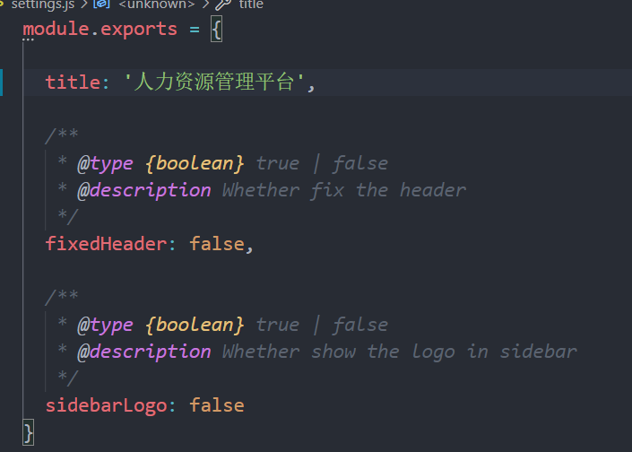
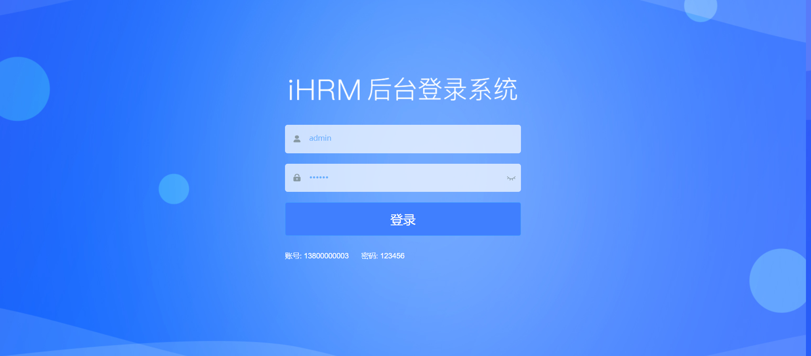
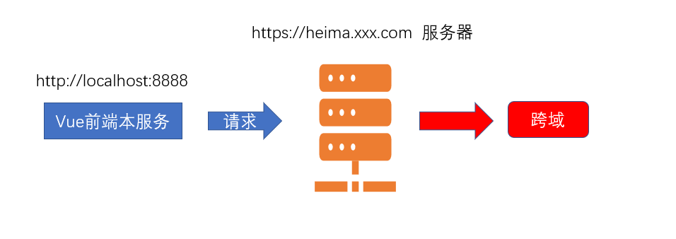
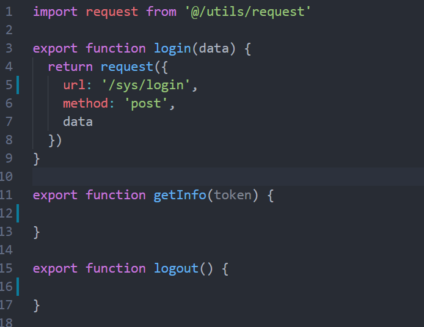
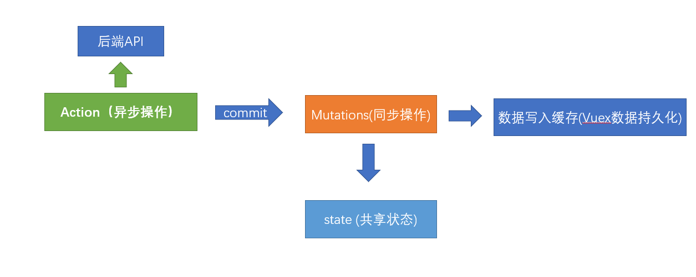
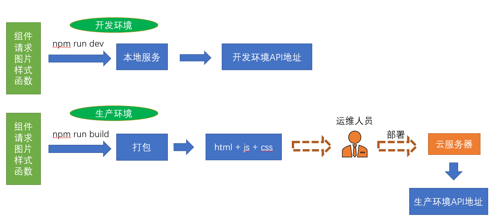
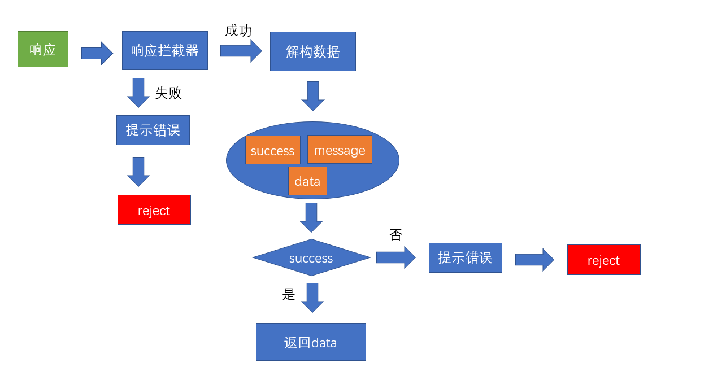

# 登录模块

[线上地址](http://ihrm-java.itheima.net/#/login)

本章节，我们将在现有模板的基础上，完成如图的登录模块的功能


## 设置固定的本地访问端口和网站名称

**`目标`**: 设置统一的本地访问端口和网站title

在正式开发业务之前，先将项目的**本地端口**和**网站名称**进行一下调整

**本地服务端口**:  在**`vue.config.js`**中进行设置

**`vue.config.js`** 就是vue项目相关的编译，配置，打包，启动服务相关的配置文件，它的核心在于**webpack**，但是又不同于webpack，相当于改良版的webpack， [文档地址](https://cli.vuejs.org/zh/)

> 如图，是开发环境服务端口的位置


我们看到上面的 **`process.env.port`**实际上是一个nodejs服务下的环境变量，该变量在哪里设置呢？

在项目下, 我们发现了**`.env.development`**和**`.env.production`**两个文件

development => 开发环境

production => 生产环境

当我们运行**npm run dev**进行开发调试的时候,此时会加载执行**`.env.development`**文件内容

当我们运行**npm run build:prod**进行生产环境打包的时候,会加载执行**`.env.production`**文件内容

所以,如果想要设置开发环境的接口,直接在**`.env.development`**中写入对于port变量的赋值即可

```bash
# 设置端口号
port = 8888
```

**`本节注意`**:修改服务的配置文件,想要生效的话,必须要重新启动服务，值‘8888’后面不能留有空格

**网站名称**

网站名称实际在**configureWebpack**选项中的**name**选项,通过阅读代码,我们会发现name实际上来源于src目录下

**`settings.js`**文件

所以,我们可以将网站名称改成"**`人力资源管理平台`**"



**提交代码**

**`本节注意`**:修改服务的配置文件,想要生效的话,必须要重新启动服务，值‘8888’后面不能留有空格

**`本节任务`**：完成网站的开发服务端口设置和网站名称设置

## 登录页面的基础布局

**`目标`**完成登录页面的基础布局

**页面效果**


首先要实现以上的页面效果, 我们可以直接将当前的登录页面进行相应的改造

**设置头部背景**

```vue
<!-- 放置标题图片 @是设置的别名-->
<div class="title-container">
        <h3 class="title">
          
        </h3>
 </div>
```

**`本节注意`**： `@`是我们在vue.config.js中设置的一个路径别名，指定src根目录，这样可以很方便的寻找文件

**设置背景图片**

```css
/* reset element-ui css */
.login-container {
  background-image: url('~@/assets/common/login.jpg'); // 设置背景图片
  background-position: center; // 将图片位置设置为充满整个屏幕
}
```

**`本节注意`**： 如需要在样式表中使用**`@`**别名的时候，需要在@前面加上一个**`~`**符号，否则不识别

**设置手机号和密码的字体颜色**

```css
$light_gray: #68b0fe;  // 将输入框颜色改成蓝色
```

**设置输入表单整体背景色**

```css
  .el-form-item {
    border: 1px solid rgba(255, 255, 255, 0.1);
    background: rgba(255, 255, 255, 0.7); // 输入登录表单的背景色
    border-radius: 5px;
    color: #454545;
  }
```

**设置错误信息的颜色**

```css
 .el-form-item__error {
    color: #fff
  }
```

**设置登录按钮的样式**

> 需要给el-button 增加一个loginBtn的class样式

```css
.loginBtn {
  background: #407ffe;
  height: 64px;
  line-height: 32px;
  font-size: 24px;
}
```

**修改显示的提示文本和登录文本**

```htmL
   <div class="tips">
        <span style="margin-right:20px;">账号: 13800000002</span>
        <span> 密码: 123456</span>
   </div>
```

经过以上的改动, 我们得到了一个比较完善的登录页面



> 解释:我们该项目的侧重点在于更多的介绍Vue中台项目所应用的技术,所以对于一些过于细节的样式或者布局,我们采用直接粘贴或者拷贝成型代码的方式,同学们可以通过课下多多练习

**提交代码**

**`本节注意`**： `@`是我们在vue.config.js中设置的一个路径别名，指定src根目录，这样可以很方便的寻找文件

**`本节注意`**： 如需要在样式表中使用**`@`**别名的时候，需要在@前面加上一个**`~`**符号，否则不识别

**`本节任务`**： 完成登录首页的基本布局

## 登录表单的校验

**`目标`**对登录表单进行规则校验

> 基础模板已经有了基础校验的代码,所以我们这一章节更多的是修正和完善

### **el-form表单校验的先决条件**


### 手机号和密码的校验

**字段名对应**

> 为什么要对应? 因为基础模板采用的是**`username`**的字段,但是实际接口中采用的是**`mobile`**的字段,为了更方便的写代码,所以我们将**`username`**改成**`mobile`**

这里除了字段名，还有我们的规则校验名称，以及prop名称。

**英文提示变成中文**

基础模板中都是**placeHolder**占位符是英文,要变成中文

登录按钮文字同样需要换成中文

**校验手机号和校验密码**

基础模板中,已经做了校验,我们针对代码进行一些优化

新规则：手机号必填，并且进行格式校验，密码必填，长度6-16位之间

```js
 data() {
    // 自定义校验函数
    const validateMobile = function(rule, value, callback) {
      // 校验value
      // if (validMobile(value)) {
      //   // 如果通过 直接执行callback
      //   callback()
      // } else {
      //   callback(new Error('手机号格式不正确'))
      // }
      validMobile(value) ? callback() : callback(new Error('手机号格式不正确'))
    }

    return {
      loginForm: {
        mobile: '13800000002',
        password: '123456'
      },
      loginRules: {
        mobile: [{ required: true, trigger: 'blur', message: '手机号不能为空' }, {
          validator: validateMobile, trigger: 'blur'
        }],
        password: [{ required: true, trigger: 'blur', message: '密码不能为空' }, {
          min: 6, max: 16, message: '密码的长度在6-16位之间 ', trigger: 'blur'
        }]
      },
      loading: false,
      passwordType: 'password',
      redirect: undefined
    }
  },
```

我们在**`utils/validate.js`**方法中增加了一个校验手机号的方法

```js
/**
 * 校验手机号
 * **/
export function validMobile(str) {
  return /^1[3-9]\d{9}$/.test(str) // 校验手机号
}
```

**`utils/validate.js`**是一个专门存放校验工具方法的文件

### 关于修饰符

**关于修饰符**

> 在该页面中，我们发现了事件的几个修饰符 **`@keyup.enter.native`**  **`@click.native.prevent`**

@keyup.**`enter`**属于按键修饰符，如果我们想监听在按回车键的时候触发，可以如下编写

```vue
<!-- 只有在 `key` 是 `Enter` 时调用 `vm.submit()` -->
<input v-on:keyup.enter="submit">
```

@keyup.enter.**`native`** 表示监听组件的原生事件，比如 keyup就是于input的原生事件，这里写native表示keyup是一个原生事件

**提交代码**

**`本节任务`**：实现登录用户的手机号和密码校验

## Vue-Cli配置跨域代理

**`目标`**: 通过配置vue-cli的代理解决跨域访问的问题

### 为什么会出现跨域？

当下,最流行的就是**`前后分离`**项目,也就是**`前端项目`**和**`后端接口`**并不在一个域名之下，那么前端项目访问后端接口必然存在**`跨域`**的行为.



> 怎么解决这种跨域 ？

**`请注意`**，我们所遇到的这种跨域是位于**开发环境**的，真正部署上线时的跨域是**生产环境**的

### 解决开发环境的跨域问题

**开发环境的跨域**

开发环境的跨域，也就是在**`vue-cli脚手架环境`**下开发启动服务时，我们访问接口所遇到的跨域问题，vue-cli为我们在本地**`开启了一个服务`**,可以通过这个服务帮我们**`代理请求`**,解决跨域问题

这就是vue-cli配置**webpack的反向代理**


> 采用vue-cli的代理配置

vue-cli的配置文件即**`vue.config.js`**,这里有我们需要的 [代理选项](https://cli.vuejs.org/zh/config/#devserver-proxy)

```js
module.exports = {
  devServer: {
   // 代理配置
    proxy: {
        // 这里的api 表示如果我们的请求地址有/api的时候,就出触发代理机制
        // localhost:8888/api/abc  => 代理给另一个服务器
        // 本地的前端  =》 本地的后端  =》 代理我们向另一个服务器发请求 （行得通）
        // 本地的前端  =》 另外一个服务器发请求 （跨域 行不通）
        '/api': {
        target: 'www.baidu.com', // 我们要代理的地址
        changeOrigin: true, // 是否跨域 需要设置此值为true 才可以让本地服务代理我们发出请求
         // 路径重写
        pathRewrite: {
            // 重新路由  localhost:8888/api/login  => www.baidu.com/api/login
            '^/api': '' // 假设我们想把 localhost:8888/api/login 变成www.baidu.com/login 就需要这么做 
        }
      },
    }
  }
}
```

以上就是我们在vue-cli项目中配置的代理设置

> 接下来,我们在代码中将要代理的后端地址变成 [后端接口地址](http://ihrm-java.itheima.net)

```js
 // 代理跨域的配置
    proxy: {
      // 当我们的本地的请求 有/api的时候，就会代理我们的请求地址向另外一个服务器发出请求
      '/api': {
        target: 'http://ihrm-java.itheima.net/', // 跨域请求的地址
        changeOrigin: true // 只有这个值为true的情况下 才表示开启跨域
      }
    }
```

**`本节注意`**：我们并没有进行**`pathRewrite`**,因为后端接口就是**`ihrm-java.itheima.net/api`**这种格式,所以不需要重写

**`vue.config.js`**的改动如果要生效,需要进行重启服务

同时，还需要注意的是，我们同时需要注释掉 mock的加载，因为mock-server会导致代理服务的异常

```js
// before: require('./mock/mock-server.js'),  // 注释mock-server加载
```

**生产环境的跨域**

生产环境表示我们已经开发完成项目，将项目部署到了服务器上,这时已经没有了vue-cli脚手架的**`辅助`**了，我们只是把打包好的**`html+js+css`**交付运维人员，放到**`Nginx`**服务器而已,所以此时需要借助**`Nginx`**的反向代理来进行

```bash
server{
    # 监听9099端口
    listen 9099;
    # 本地的域名是localhost
    server_name localhost;
    #凡是localhost:9099/api这个样子的，都转发到真正的服务端地址http://baidu.com
    location ^~ /api {
        proxy_pass http://baidu.com;
    }    
}
```

**`注意`**:这里的操作一般由运维人员完成,需要前端进行操作,这里我们进行一下简单了解

更多正向代理和反向代理知识,请阅读这篇文章[Nginx反向代理](https://www.cnblogs.com/ysocean/p/9392908.html)

**提交代码**

**`本节注意`**：我们并没有进行**`pathRewrite`**,因为后端接口就是**`ihrm-java.itheima.net/api`**这种格式,所以不需要重写

**`本节任务`**： 配置vue-cli的反向代理，实现后端接口的跨域访问

## 封装单独的登录接口

**`目标`** 在单独请求模块中,单独封装登录接口

> 完成登录模块之后，我们需要对登录接口进行封装

首先，查阅接口文档中的登录接口

> 基础模板已经有了原来的登录代码,我们只需要进行简单的改造即可

```js
export function login(data) {
  // 返回一个axios对象 => promise  // 返回了一个promise对象
  return request({
    url: '/sys/login', // 因为所有的接口都要跨域 表示所有的接口要带 /api
    method: 'post',
    data
  })
}
```

如图



**提交代码**

**`本节任务`**：封装单独的登录接口

## 封装Vuex的登录Action并处理token

**`目标`**在vuex中封装登录的action,并处理token

> 在这个小节中，我们将在vuex中加入对于用户的登录的处理

### 在Vuex中对token进行管理

在传统模式中，我们登录的逻辑很简单，如图


> 上图中，组件直接和接口打交道，这并没有什么问题，但是对于用户token这一高频使用的**`钥匙`**，我们需要让vuex来介入，将用户的token状态共享，更方便的读取，如图


**实现store/modules/user.js基本配置**

```js
// 状态
const state = {}
// 修改状态
const mutations = {}
// 执行异步
const actions = {}
export default {
  namespaced: true,
  state,
  mutations,
  actions
}

```

**设置token的共享状态**

```js
const state = {
  token: null
}
```

> 我们需要知道,**`钥匙`**不能每次都通过登录获取,我们可以将token放置到本地的缓存中

在**`utils/auth.js`**中,基础模板已经为我们提供了**`获取token`**,**`设置token`**,**`删除token`**的方法,可以直接使用

只需要将存储的key放置成特定值即可

```js
import Cookies from 'js-cookie'

const TokenKey = 'hrsaas-ihrm-token' // 设定一个独一无二的key

export function getToken() {
  return Cookies.get(TokenKey)
}

export function setToken(token) {
  return Cookies.set(TokenKey, token)
}

export function removeToken() {
  return Cookies.remove(TokenKey)
}

```

**初始化token状态** - **`store/modules/user.js`**

```js
import { getToken, setToken, removeToken } from '@/utils/auth'
// 状态
// 初始化的时候从缓存中读取状态 并赋值到初始化的状态上
// Vuex的持久化 如何实现 ？ Vuex和前端缓存相结合
const state = {
  token: getToken() // 设置token初始状态   token持久化 => 放到缓存中
}
```

**提供修改token的mutations**

```js
// 修改状态
const mutations = {
  // 设置token
  setToken(state, token) {
    state.token = token // 设置token  只是修改state的数据  123 =》 1234
    // vuex变化 => 缓存数据
    setToken(token) // vuex和 缓存数据的同步
  },
  // 删除缓存
  removeToken(state) {
    state.token = null // 删除vuex的token
    removeToken() // 先清除 vuex  再清除缓存 vuex和 缓存数据的同步
  }
}
```

### 封装登录的Action

**封装登录的action**

> 登录action要做的事情,**`调用登录接口`**,**`成功后设置token到vuex`**,**`失败则返回失败`**

```js
// 执行异步
const actions = {
  // 定义login action  也需要参数 调用action时 传递过来的参数
  async login(context, data) {
    const result = await login(data) // 实际上就是一个promise  result就是执行的结果
    // axios默认给数据加了一层data
    if (result.data.success) {
      // 表示登录接口调用成功 也就是意味着你的用户名和密码是正确的
      // 现在有用户token
      // actions 修改state 必须通过mutations
      context.commit('setToken', result.data.data)
    }
  }
}
```

> 上述代码中,我们使用了**`async/await`**语法,如果用**`then`**语法也是可以的

```js
 // 为什么async/await 不用返回new Promise,因为 async函数本身就是 Promise,promise的值返回的值  
login(context, data) {
    return new Promise(function(resolve) {
      login(data).then(result => {
        if (result.data.success) {
          context.commit('setToken',  result.data.data) // 提交mutations设置token
          resolve()  // 表示执行成功了
        }
      })
    })
  }
```

> 以上两种写法都是OK的,我们在项目研发过程中,尽可能的采用前一种

除此之外，为了更好的让其他模块和组件更好的获取token数据，我们可以在**`store/getters.js`**中将token值作为公共的访问属性放出

```js
const getters = {
  sidebar: state => state.app.sidebar,
  device: state => state.app.device,
  token: state => state.user.token // 在根级的getters上 开发子模块的属性给别人看 给别人用
}
export default getters

```

**提交代码**

> 通过本节内容，我们要掌握在Vuex中如何来管理共享状态



**`本节任务`**：封装Vuex的登录Action并处理token

## request中环境变量和异常的处理

**`目标`**设置request环境变量和异常处理

### 区分axios在不同环境中的请求基础地址

> 为什么会有环境变量之分? 如图



> 从上图可以看出，开发环境实际上就是在自己的本地开发或者要求不那么高的环境，但是一旦进入生产，就是**`真实的数据`**。 拿银行作比喻，如果你在开发环境拿生产环境的接口做测试，银行系统就会发生很大的风险。

前端主要区分两个环境,**`开发环境`**,**`生产环境`**

>  也就是两个环境发出的请求地址是不同的，用什么区分呢?

**环境变量**

```bash
$ process.env.NODE_ENV # 当为production时为生产环境 为development时为开发环境
```

**环境文件**

 我们可以在**`.env.development`**和**`.env.production`**定义变量，变量自动就为当前环境的值

基础模板在以上文件定义了变量**`VUE_APP_BASE_API`**，该变量可以作为axios请求的**`baseURL`**

我们会发现,在模板中,两个值分别为**`/dev-api`**和**`/prod-api`**

但是我们的开发环境代理是**`/api`**，所以可以统一下

```bash
# 开发环境的基础地址和代理对应
VUE_APP_BASE_API = '/api'
```

```bash
# 这里配置了/api,意味着需要在Nginx服务器上为该服务配置 nginx的反向代理对应/prod-api的地址 
VUE_APP_BASE_API = '/prod-api'  
```

**`本节注意`**：我们这里生产环境和开发环境设置了不同的值，后续我们还会在生产环境部署的时候，去配置该值所对应的反向代理，反向代理指向哪个地址，完全由我们自己决定，不会和开发环境冲突

**在request中设置baseUrl**

```js
const service = axios.create({
  // 如果执行 npm run dev  值为 /api 正确  /api 这个代理只是给开发环境配置的代理
  // 如果执行 npm run build 值为 /prod-api  没关系  运维应该在上线的时候 给你配置上 /prod-api的代理
  baseURL: process.env.VUE_APP_BASE_API, // 设置axios请求的基础的基础地址
  timeout: 5000 // 定义5秒超时
}) // 创建一个axios的实例
```

### 处理axios的响应拦截器

> OK，除此之外,axios返回的数据中默认增加了一层**`data的包裹`**,我们需要在这里处理下

> 并且,人资项目的接口,如果执行失败,只是设置了**`success`**为**`false`**，并没有reject，我们需要一并处理下

处理逻辑如图



```js
// 响应拦截器
service.interceptors.response.use(response => {
  // axios默认加了一层data
  const { success, message, data } = response.data
  //   要根据success的成功与否决定下面的操作
  if (success) {
    return data
  } else {
    // 业务已经错误了 还能进then ? 不能 ！ 应该进catch
    Message.error(message) // 提示错误消息
    return Promise.reject(new Error(message))
  }
}, error => {
  Message.error(error.message) // 提示错误信息
  return Promise.reject(error) // 返回执行错误 让当前的执行链跳出成功 直接进入 catch
})
```

> 既然在request中已经默认去除了一层data的外衣，所以我们也将上节login的action进行一下改动

**处理登录的返回结构问题**

```js
  async login(context, data) {
    // 经过响应拦截器的处理之后 这里的result实际上就是 token
    const result = await login(data) // 实际上就是一个promise  result就是执行的结果
    // axios默认给数据加了一层data
    // 表示登录接口调用成功 也就是意味着你的用户名和密码是正确的
    // 现在有用户token
    // actions 修改state 必须通过mutations
    context.commit('setToken', result)
  }
```

**提交代码**

**`本节任务`**： 完成request环境变量和异常的处理

## 登录页面调用登录action,处理异常

**`目标`** 调用vuex中的登录action,并跳转到主页

> 按照如图的业务逻辑，把剩下的内容在登录页面引入


**引入actions辅助函数**

```js
import { mapActions } from 'vuex'  // 引入vuex的辅助函数
```

**引入action方法**

> 此处，我们采用直接引入模块action的方式，后面我们采用分模块的引用方式

```js
methods: {
    ...mapActions(['user/login'])
}
```

**调用登录**

```js
  this.$refs.loginForm.validate(async isOK => {
        if (isOK) {
          try {
            this.loading = true
            // 只有校验通过了 我们才去调用action
            await this['user/login'](this.loginForm)
            // 应该登录成功之后
            // async标记的函数实际上一个promise对象
            // await下面的代码 都是成功执行的代码
            this.$router.push('/')
          } catch (error) {
            console.log(error)
          } finally {
            //  不论执行try 还是catch  都去关闭转圈
            this.loading = false
          }
        }
      })
```

**提交代码**

**`本节注意`**：我们调用的是Vuex中子模块的action，该模块我们进行了namespaced: true，所以引用aciton时需要带上**`user/`**, 并且在使用该方法时，直接使用 **`this['user/login']`**, 使用this.user/login 语法是错误的

**`本节任务`**：登录页面调用登录action，处理异常