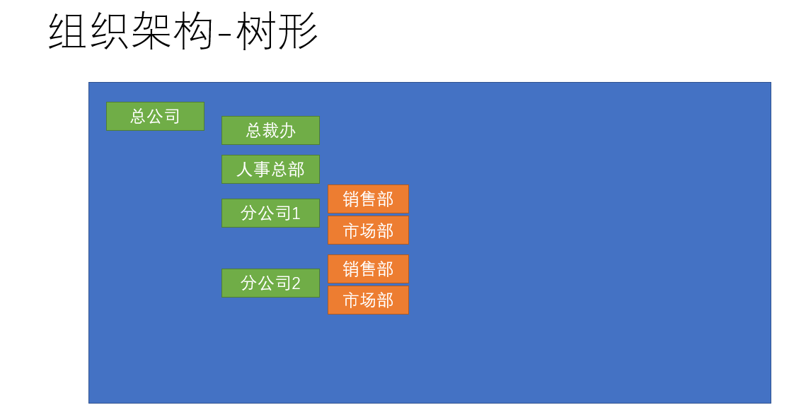
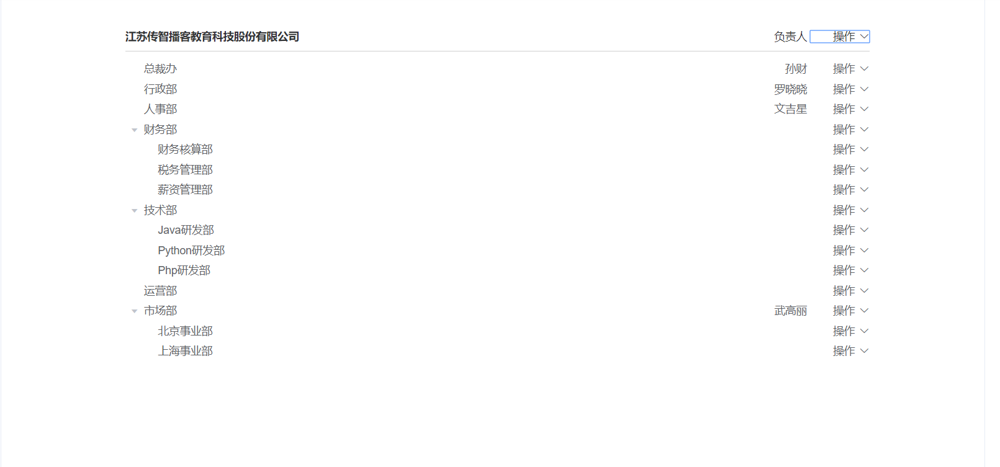
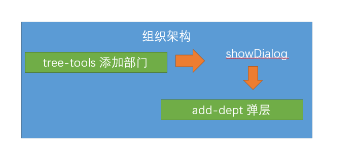
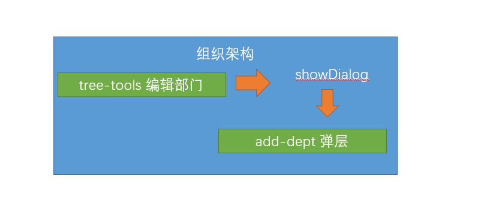

## 组织架构树形结构布局

**`目标`**：使用element-UI组件布局组织架构的基本布局

### 认识组织架构

[组织架构产品prd]([http://czpm.itcast.cn/ihrm/#g=1&p=%E7%BB%84%E7%BB%87%E6%9E%B6%E6%9E%84](http://czpm.itcast.cn/ihrm/#g=1&p=组织架构))



> 一个企业的组织架构是该企业的灵魂，组织架构多常采用树形金字塔式结构，本章节，我们布局出页面的基本结构

 

### 实现组织架构的头部内容

首先实现头部的结构，采用element的**行列布局**

```vue
   <el-card class="tree-card">
        <!-- 用了一个行列布局 -->
        <el-row type="flex" justify="space-between" align="middle" style="height: 40px">
          <el-col>
            <span>江苏传智播客教育科技股份有限公司</span>
          </el-col>
          <el-col :span="4">
            <el-row type="flex" justify="end">
              <!-- 两个内容 -->
              <el-col>负责人</el-col>
              <el-col>
                <!-- 下拉菜单 element -->
                <el-dropdown>
                  <span>
                    操作<i class="el-icon-arrow-down" />
                  </span>
                  <!-- 下拉菜单 -->
                  <el-dropdown-menu slot="dropdown">
                    <el-dropdown-item>添加子部门</el-dropdown-item>
                  </el-dropdown-menu>
                </el-dropdown>
              </el-col>
            </el-row>
          </el-col>
        </el-row>
      </el-card>
```

**样式**

```css
<style scoped>
.tree-card {
  padding: 30px  140px;
  font-size:14px;
}
</style>

```


### 树形组件认识

接下来，实现树形的结构，采用element的**[tree组件](https://element.eleme.cn/#/zh-CN/component/tree)**， 如图效果


> 树形组件属性

| 参数               | 说明                                                 | 类型    | 可选值 | 默认值 |
| :----------------- | :--------------------------------------------------- | :------ | :----- | :----- |
| default-expand-all | 是否默认展开所有节点                                 | boolean | —      | —      |
| data               | 展示数据                                             | array   | —      | —      |
| node-key           | 每个树节点用来作为唯一标识的属性，整棵树应该是唯一的 | String  | —      | —      |
| props              | 配置选项，具体看下表                                 | object  | —      | —      |

**props属性**

| 参数     | 说明                                                     | 类型                          | 可选值 | 默认值 |
| :------- | :------------------------------------------------------- | :---------------------------- | :----- | :----- |
| label    | 指定节点标签为节点对象的某个属性值                       | string, function(data, node)  | —      | —      |
| children | 指定子树为节点对象的某个属性值                           | string                        | —      | —      |
| disabled | 指定节点选择框是否禁用为节点对象的某个属性值             | boolean, function(data, node) | —      | —      |
| isLeaf   | 指定节点是否为叶子节点，仅在指定了 lazy 属性的情况下生效 | boolean, function(data, node) | —      | —      |

**data**是组成树形数据的关键，如下的数据便能构建树形数据

```json
 [{
          label: '一级 1',
          children: [{
            label: '二级 1-1',
            children: [{
              label: '三级 1-1-1'
            }]
          }]
        }, {
          label: '一级 2',
          children: [{
            label: '二级 2-1',
            children: [{
              label: '三级 2-1-1'
            }]
          }, {
            label: '二级 2-2',
            children: [{
              label: '三级 2-2-1'
            }]
          }]
        }, {
          label: '一级 3',
          children: [{
            label: '二级 3-1',
            children: [{
              label: '三级 3-1-1'
            }]
          }, {
            label: '二级 3-2',
            children: [{
              label: '三级 3-2-1'
            }]
          }]
        }]
```


### 实现树形的静态组织架构

由此，我们首先实现静态数据的组织架构

```vue
 <!--放置一个属性   这里的props和我们之前学习的父传子 的props没关系-->
 <el-tree :data="departs" :props="defaultProps" />
export default {
  data() {
    return {
      defaultProps: {
        label: 'name'
      },
      departs: [{ name: '总裁办', children: [{ name: '董事会' }] },
        { name: '行政部' }, { name: '人事部' }]
    }
  }
}
```

> 接下来，对每个层级节点增加显示内容，此时需要用到tree的插槽

```vue
 <el-tree :data="departs" :props="defaultProps" :default-expand-all="true">
          <!-- 传入内容 插槽内容 会循环多次 有多少节点 就循环多少次 -->
          <!-- 作用域插槽 slot-scope="obj" 接收传递给插槽的数据   data 每个节点的数据对象-->
          <el-row slot-scope="{ data }" type="flex" justify="space-between" align="middle" style="height: 40px; width: 100%">
            <el-col>
              <!-- 左侧内容 -->
              <span>{{ data.name }}</span>
            </el-col>
            <el-col :span="4">
              <el-row type="flex" justify="end">
                <el-col>{{ data.manager }}</el-col>
                <el-col>
                  <!-- 放置下拉菜单 -->
                  <el-dropdown>
                    <!-- 内容 -->
                    <span>操作
                      <i class="el-icon-arrow-down" />
                    </span>
                    <!-- 具名插槽 -->
                    <el-dropdown-menu slot="dropdown">
                      <!-- 下拉选项 -->
                      <el-dropdown-item>添加子部门</el-dropdown-item>
                      <el-dropdown-item>编辑部门</el-dropdown-item>
                      <el-dropdown-item>删除部门</el-dropdown-item>

                    </el-dropdown-menu>
                  </el-dropdown>
                </el-col>
              </el-row>

            <!-- 右侧内容 -->
            </el-col>
          </el-row>        </el-tree>
<script>
export default {
  data() {
    return {
      departs: [{ name: '总裁办', manager: '曹操', children: [{ name: '董事会', manager: '曹丕' }] },
        { name: '行政部', manager: '刘备' },
        { name: '人事部', manager: '孙权' }],
      defaultProps: {
        label: 'name' // 表示 从这个属性显示内容
      }
    }
  }
}
</script>
```

最终形成静态结构效果


**提交代码**

**`本节任务`**：完成树形结构的显示

##  将树形的操作内容单独抽提成组件

**`目标`**： 将树形的操作内容单独抽提成组件

### 封装单独的树操作栏组件

> 通过第一个章节，我们发现，树形的顶级内容实际和子节点的内容是一致的，此时可以将该部分抽提成一个组件，节省代码

组件 **`src/views/departments/components/tree-tools.vue`**

```vue
<template>
  <el-row type="flex" justify="space-between" align="middle" style="height: 40px;width: 100%">
    <el-col>
      <!-- 名称应该变成 对应的节点中的name -->
      <span>{{ treeNode.name }}</span>
    </el-col>
    <el-col :span="4">
      <el-row type="flex" justify="end">
        <!-- 两个内容 -->
        <el-col>{{ treeNode.manager }}</el-col>
        <el-col>
          <!-- 下拉菜单 element -->
          <el-dropdown>
            <span>
              操作<i class="el-icon-arrow-down" />
            </span>
            <!-- 下拉菜单 -->
            <el-dropdown-menu slot="dropdown">
              <el-dropdown-item>添加子部门</el-dropdown-item>
              <el-dropdown-item>编辑部门</el-dropdown-item>
              <el-dropdown-item>删除部门</el-dropdown-item>
            </el-dropdown-menu>
          </el-dropdown>
        </el-col>
      </el-row>
    </el-col>
  </el-row>
</template>

<script>
// 该组件需要对外开放属性 外部需要提供一个对象 对象里需要有name  manager
export default {
  // props可以用数组来接收数据 也可以用对象来接收
  // props: {   props属性: {  配置选项 }  }
  props: {
    //   定义一个props属性
    treeNode: {
      type: Object, // 对象类型
      required: true // 要求对方使用您的组件的时候 必须传treeNode属性 如果不传 就会报错
    }
  }
}
</script>


```

### 在组织架构中应用操作栏组件

接下来，在**`src/views/departments/index.vue`**进行代码的简化

```vue
<template>
  <div class="dashboard-container">
    <div class="app-container">
      <!-- 实现页面的基本布局 -->
      <el-card class="tree-card">
        <!-- 用了一个行列布局 -->
        <!-- 缺少treeNode -->
        <tree-tools :tree-node="company" />
        <!--放置一个属性   这里的props和我们之前学习的父传子 的props没关系-->
        <el-tree :data="departs" :props="defaultProps" default-expand-all>
          <!-- 说明el-tree里面的这个内容 就是插槽内容 => 填坑内容  => 有多少个节点循环多少次 -->
          <!-- scope-scope 是 tree组件传给每个节点的插槽的内容的数据 -->
          <!-- 顺序一定是 执行slot-scope的赋值 才去执行 props的传值 -->
          <tree-tools slot-scope="{ data }" :tree-node="data" />
        </el-tree>
      </el-card>
    </div>
  </div>
</template>

```

上面代码中，company变量需要在data中定义

```js
company: { name: '江苏传智播客教育科技股份有限公司', manager: '负责人' },
```

同时，由于在两个位置都使用了该组件，但是放置在最上层的组件是不需要显示 **`删除部门`**和**`编辑部门`**的

所以，增加一个新的属性 **`isRoot（是否根节点）`**进行控制

```js
 props: {
    treeNode: {
      required: true, // 设置当前数据为必填
      type: Object // 类型是Object
    },
    isRoot: {
      type: Boolean,
      default: false
    }
  }
 <tree-tools :tree-node="company" :is-root="true" />
     
```

组件中， 根据isRoot判断显示

```vue
     <!-- 编辑部门和删除部门只会在子节点上显示 -->
          <el-dropdown-item v-if="!isRoot">编辑部门</el-dropdown-item>
         <el-dropdown-item v-if="!isRoot">删除部门</el-dropdown-item>
```

> 通过封装，代码看上去更加紧凑，简洁，这就是封装的魅力

**提交代码**

**`本节任务`**：将树形内容单独抽提组件

## 获取组织架构数据，并进行树形处理

**`目标`**获取真实的组织架构数据，并将其转化成树形数据显示在页面上

### 封装API接口，获取组织架构数据

> 现在基本的静态结构已经形成，接下来需要获取真实的数据

首先，**封装获取组织架构的请求** **`src/api/departments.js`**

```js
/** *
 *
 * 获取组织架构数据
 * **/
export function getDepartments() {
  return request({
    url: '/company/department'
  })
}

```

在钩子函数中调用接口

```js
import TreeTools from './components/tree-tools'
import { getDepartments } from '@/api/departments'
export default {
  components: {
    TreeTools
  },
  data() {
    return {
      company: { }, // 就是头部的数据结构
      departs: [],
      defaultProps: {
        label: 'name' // 表示 从这个属性显示内容
      }
    }
  },
  created() {
    this.getDepartments() // 调用自身的方法
  },
  methods: {
    async getDepartments() {
      const result = await getDepartments()
      this.company = { name: result.companyName, manager: '负责人' }
      this.departs = result.depts // 需要将其转化成树形结构
      console.log(result)
    }
  }
}
```

### 将数组数据转化成树形结构

然后，我们需要将列表型的数据，转化成树形数据，这里需要用到**递归算法**


封装一个工具方法，**`src/utils/index.js`**

```js
/** *
 *
 *  将列表型的数据转化成树形数据 => 递归算法 => 自身调用自身 => 一定条件不能一样， 否则就会死循环
 *  遍历树形 有一个重点 要先找一个头儿
 * ***/
export function tranListToTreeData(list, rootValue) {
  var arr = []
  list.forEach(item => {
    if (item.pid === rootValue) {
      // 找到之后 就要去找 item 下面有没有子节点
      const children = tranListToTreeData(list, item.id)
      if (children.length) {
        // 如果children的长度大于0 说明找到了子节点
        item.children = children
      }
      arr.push(item) // 将内容加入到数组中
    }
  })
  return arr
}
```

调用转化方法，转化树形结构

```js
  this.company = { name: result.companyName, manager: '负责人' } // 这里定义一个空串  因为 它是根 所有的子节点的数据pid 都是 ""
   this.departs = transListToTreeData(result.depts, '')
```

这样一来，树形数据就有了，下一章节，就可以针对部门进行操作

**提交代码**

**`本节任务`** 获取组织架构数据，并进行树形处理

## 删除部门功能实现

**`目标`**实现操作功能的删除功能

### 封装删除接口，注册下拉菜单事件

首先，封装删除功能模块 **`src/api/departments.js`**

```js
/** *
 *  根据id根据部门  接口是根据restful的规则设计的   删除 delete  新增 post  修改put 获取 get
 * **/
export function delDepartments(id) {
  return request({
    url: `/company/department/${id}`,
    method: 'delete'
  })
}
```

然后，在tree-tools组件中，监听下拉菜单的点击事件  **`src/views/departments/index.vue`**

```vue
          <el-dropdown @command="operateDepts">
            <span>
              操作<i class="el-icon-arrow-down" />
            </span>
            <!-- 下拉菜单 -->
            <el-dropdown-menu slot="dropdown">
              <el-dropdown-item command="add">添加子部门</el-dropdown-item>
              <!-- 编辑部门和删除部门只会在子节点上显示 -->
              <el-dropdown-item v-if="!isRoot" command="edit">编辑部门</el-dropdown-item>
              <el-dropdown-item v-if="!isRoot" command="del">删除部门</el-dropdown-item>
            </el-dropdown-menu>
          </el-dropdown>
```

>dropdown下拉菜单的监听事件command

```js
    // 操作节点调用的方法
    operateDepts(type) {
      if (type === 'add') {
        // 添加子部门的操作
      } else if (type === 'edit') {
        //  编辑部门的操作
      } else {
        //  删除操作
      }
    }
```

### 调用删除接口，通知父组件更新数据

> 删除之前，提示用户是否删除，然后调用删除接口

```js
    // 操作节点调用的方法
    operateDepts(type) {
      if (type === 'add') {
        // 添加子部门的操作
      } else if (type === 'edit') {
        //  编辑部门的操作
      } else {
        //  删除操作
        this.$confirm('确定要删除该部门吗').then(() => {
          // 如果点击了确定就会进入then
          return delDepartments(this.treeNode.id) // 返回promise对象
        }).then(() => {
          //  如果删除成功了  就会进入这里
        })
      }
    }
```

> 上面代码中，我们已经成功删除了员工数据，但是怎么通知父组件进行更新呢

在前面的课程中，我们已经学习过可以通过自定义事件**`this.$emit`**的方式来进行

```js
  //  如果删除成功了  就会进入这里
          this.$emit('delDepts') // 触发自定义事件
          this.$message.success('删除部门成功')
```

父组件监听事件 **`src/views/department/index.vue`**

```vue
<tree-tools slot-scope="obj" :tree-node="obj.data" @delDepts="getDepartments" />
```

**提交代码**

**`本节任务`**：删除部门功能实现

## 新增部门功能-建立组件

**`目标`**：实现新增部门功能的组件建立

### 封装新增接口，新建组件中的弹层结构

首先， 封装新增部门的api模块  **`src/api/departments.js`**

```js
/**
 *  新增部门接口
 *
 * ****/
export function addDepartments(data) {
  return request({
    url: '/company/department',
    method: 'post',
    data
  })
}

```

然后，我们需要构建一个新增部门的窗体组件 **`src/views/department/components/add-dept.vue`**

其中的交互设计如下



[设计要求]([http://czpm.itcast.cn/ihrm/#g=1&p=%E7%BB%84%E7%BB%87%E6%9E%B6%E6%9E%84](http://czpm.itcast.cn/ihrm/#g=1&p=组织架构))

```vue
<template>
  <!-- 新增部门的弹层 -->
  <el-dialog title="新增部门">
    <!-- 表单组件  el-form   label-width设置label的宽度   -->
    <!-- 匿名插槽 -->
    <el-form label-width="120px">
      <el-form-item label="部门名称">
        <el-input style="width:80%" placeholder="1-50个字符" />
      </el-form-item>
      <el-form-item label="部门编码">
        <el-input style="width:80%" placeholder="1-50个字符" />
      </el-form-item>
      <el-form-item label="部门负责人">
        <el-select style="width:80%" placeholder="请选择" />
      </el-form-item>
      <el-form-item label="部门介绍">
        <el-input style="width:80%" placeholder="1-300个字符" type="textarea" :rows="3" />
      </el-form-item>
    </el-form>
    <!-- el-dialog有专门放置底部操作栏的 插槽  具名插槽 -->
    <el-row slot="footer" type="flex" justify="center">
      <!-- 列被分为24 -->
      <el-col :span="6">
        <el-button type="primary" size="small">确定</el-button>
        <el-button size="small">取消</el-button>
      </el-col>
    </el-row>
  </el-dialog>
</template>
```

### 点击新增子部门显示弹层组件

然后，我们需要用属性控制组件的显示或者隐藏

```js
  // 需要传入一个props变量来控制 显示或者隐藏
  props: {
    showDialog: {
      type: Boolean,
      default: false
    }
  }
```

```vue
<el-dialog title="新增部门" :visible="showDialog">
```

在**`departments/index.vue`** 中引入该组件

```js
import AddDept from './components/add-dept' // 引入新增部门组件
export default {
  components: { AddDept }
}
```

定义控制窗体显示的变量**`showDialog`**

```js
 data() {
    return {
      showDialog: false // 显示窗体
    }
  },
    <!-- 放置新增弹层组件  -->
    <add-dept :show-dialog="showDialog" />
```

当点击新增部门时，弹出组件

>  注意，点击新增时tree-tools组件，所以这里，我们依然需要子组件调用父组件

**子组件触发新增事件**· **`src/views/departments/tree-tools.vue`** 

```js
  if (type === 'add') {
        // 添加子部门的操作
        // 告诉父组件 显示弹层
        this.$emit('addDepts', this.treeNode) // 为何传出treeNode 因为是添加子部门 需要当前部门的数据
      }
```

**父组件监听事件**   

```vue
 <tree-tools slot-scope="obj" :tree-node="obj.data" @delDepts="getDepartments" @addDepts="addDepts"  />

```

**方法中弹出层,记录在哪个节点下添加子部门**

```js
 addDepts(node) {
      this.showDialog = true // 显示弹层
      // 因为node是当前的点击的部门， 此时这个部门应该记录下来,
      this.node = node
    }
```

**提交代码**


**`本节任务`**：新增部门功能-建立组件

## 完成新增部门的规则校验

**`目标`** 完成新增部门功能的规则校验和数据提交部分

### 完成新增表单的基本校验条件

部门名称（name）：必填 1-50个字符  / 同级部门中禁止出现重复部门

部门编码（code）：必填 1-50个字符  / 部门编码在整个模块中都不允许重复

部门负责人（manager）：必填

部门介绍 ( introduce)：必填 1-300个字符

> 定义数据结构

```js
  formData: {
        name: '', // 部门名称
        code: '', // 部门编码
        manager: '', // 部门管理者
        introduce: '' // 部门介绍
  },
```

> 完成表单校验需要的前置条件

* el-form配置model和rules属性
* el-form-item配置prop属性
* 表单进行v-model双向绑定

### 配置新增表单的基本校验规则

> 根据这些要求，校验规则

```js
  data() {
    return {
      // 定义表单数据
      formData: {
        name: '', // 部门名称
        code: '', // 部门编码
        manager: '', // 部门管理者
        introduce: '' // 部门介绍
      },
      // 定义校验规则
      rules: {
        name: [{ required: true, message: '部门名称不能为空', trigger: 'blur' },
          { min: 1, max: 50, message: '部门名称要求1-50个字符', trigger: 'blur' }],
        code: [{ required: true, message: '部门编码不能为空', trigger: 'blur' },
          { min: 1, max: 50, message: '部门编码要求1-50个字符', trigger: 'blur' }],
        manager: [{ required: true, message: '部门负责人不能为空', trigger: 'blur' }],
        introduce: [{ required: true, message: '部门介绍不能为空', trigger: 'blur' },
          { trigger: 'blur', min: 1, max: 300, message: '部门介绍要求1-50个字符' }]
      }
    }
  }
```

### 部门名称和部门编码的自定义校验

**`注意`**：部门名称和部门编码的规则 有两条我们需要通过**`自定义校验函数validator`**来实现

> 首先，在校验名称和编码时，要获取最新的组织架构，这也是我们这里trigger采用blur的原因，因为change对于访问的频率过高，我们需要控制访问频率

```js
      // 首先获取最新的组织架构数据
      const { depts } = await getDepartments()
```

> 部门名称不能和**`同级别`**的重复，这里注意，我们需要找到所有同级别的数据，进行校验，所以还需要另一个参数pid

```js
props: {
    //   用来控制窗体是否显示或者隐藏
    showDialog: {
      type: Boolean,
      default: false
    },
    // 当前操作的节点
    treeNode: {
      type: Object,
      default: null
    }
  },
  <add-dept :show-dialog="showDialog" :tree-node="node" />
```

根据当前部门id，找到所有子部门相关的数据，判断是否重复

```js
 // 现在定义一个函数 这个函数的目的是 去找 同级部门下 是否有重复的部门名称
    const checkNameRepeat = async(rule, value, callback) => {
      // 先要获取最新的组织架构数据
      const { depts } = await getDepartments()
      // depts是所有的部门数据
      // 如何去找技术部所有的子节点
      const isRepeat = depts.filter(item => item.pid === this.treeNode.id).some(item => item.name === value)
      isRepeat ? callback(new Error(`同级部门下已经有${value}的部门了`)) : callback()
    }
```

检查部门编码的过程同理

```js
 // 检查编码重复
    const checkCodeRepeat = async(rule, value, callback) => {
      // 先要获取最新的组织架构数据
      const { depts } = await getDepartments()
      const isRepeat = depts.some(item => item.code === value && value) // 这里加一个 value不为空 因为我们的部门有可能没有code
      isRepeat ? callback(new Error(`组织架构中已经有部门使用${value}编码`)) : callback()
    }
```

在规则中定义

```json
     // 定义校验规则
      rules: {
        name: [{ required: true, message: '部门名称不能为空', trigger: 'blur' },
          { min: 1, max: 50, message: '部门名称要求1-50个字符', trigger: 'blur' }, {
            trigger: 'blur',
            validator: checkNameRepeat // 自定义函数的形式校验
          }],
        code: [{ required: true, message: '部门编码不能为空', trigger: 'blur' },
          { min: 1, max: 50, message: '部门编码要求1-50个字符', trigger: 'blur' }, {
            trigger: 'blur',
            validator: checkCodeRepeat
          }],
        manager: [{ required: true, message: '部门负责人不能为空', trigger: 'blur' }],
        introduce: [{ required: true, message: '部门介绍不能为空', trigger: 'blur' },
          { trigger: 'blur', min: 1, max: 300, message: '部门介绍要求1-50个字符' }]
      }
```

### 处理首部内容的pid数据

**`需要注意`**：在最根级的**`tree-tools`**组件中，由于treenode属性中没有id，id便是undefined，但是通过undefined进行等值判断是寻找不到对应的根节点的， 所以在传值时，我们将id属性设置为 **`“”`**

**`src/views/departments/index.vue`**

```js
 async getDepartments() {
      const result = await getDepartments()
      this.departs = transListToTreeData(result.depts, '')
      this.company = { name: result.companyName, manager: '负责人', id: '' }
 },
```

**提交代码**

**`本节任务`**：完成新增部门的规则校验

## 新增部门功能-部门负责人数据

**`目标`**：获取新增表单中的部门负责人下拉数据

> 在上节的表单中，部门负责人是下拉数据，我们应该从**`员工接口`**中获取该数据

首先，封装获取简单员工列表的模块 **`src/api/employees.js`**

```js
import request from '@/utils/request'

/**
 *  获取员工的简单列表
 * **/
export function getEmployeeSimple() {
  return request({
    url: '/sys/user/simple'
  })
}

```

然后，在**`add-dept.vue`**中的select聚焦事件**`focus`**中调用该接口，因为我们要获取实时的最新数据

```vue
   <el-select v-model="formData.manager" style="width:80%" placeholder="请选择" @focus="getEmployeeSimple">
          <!-- 需要循环生成选项   这里做一下简单的处理 显示的是用户名 存的也是用户名-->
          <el-option v-for="item in peoples" :key="item.id" :label="item.username" :value="item.username" />
        </el-select>
```

获取员工列表

```js
import  { getEmployeeSimple }   from '@/api/employees'
  methods: {
    // 获取员工简单列表数据
    async  getEmployeeSimple() {
      this.peoples = await getEmployeeSimple()
    }
  }
  peoples: [] // 接收获取的员工简单列表的数据

```

**提交代码**

**`本节任务`**：新增部门功能-部门负责人数据

## 新增功能-提交-取消-关闭

**`目标`**： 完成新增模块的提交-取消-关闭等功能

### 校验通过，调用新增接口

> 当点击新增页面的确定按钮时，我们需要完成对表单的整体校验，如果校验成功，进行提交

首先，在点击确定时，校验表单

**给el-form定义一个ref属性**

```vue
    <el-form ref="deptForm" :model="formData" :rules="rules" label-width="120px">
```

```js
    // 点击确定时触发
    btnOK() {
      this.$refs.deptForm.validate(isOK => {
        if (isOK) {
          // 表示可以提交了
        }
      })
    }
```

然后，在校验通过时，调用新增接口

> 因为是添加子部门，所以我们需要将新增的部门pid设置成当前部门的id，新增的部门就成了自己的子部门

```js
    // 点击确定时触发
    btnOK() {
      this.$refs.deptForm.validate(async isOK => {
        if (isOK) {
          // 表示可以提交了
          await addDepartments({ ...this.formData, pid: this.treeNode.id }) // 调用新增接口 添加父部门的id
        }
      })
    }
```

同样，在新增成功之后，调用告诉父组件，重新拉取数据

```js
 this.$emit('addDepts')
```

父组件

```vue
 <add-dept :show-dialog="showDialog" :tree-node="node" @addDepts="getDepartments" />

```

**`本节注意`**：同学们可能会疑惑，我们**`tree-tools.vue`** 和**`add-dept.vue`**两个组件都触发了addDepts事件，不冲突吗？

这里，我们触发的自定义事件都是组件自身的，他们之间没有任何关系，只是名字相同而已，大家不要混淆

### 利用sync修饰符关闭新增弹层

> 这里我们学习一个新的技巧，**`sync修饰符`**

 按照常规，想要让父组件更新**`showDialog`**的话，需要这样做 

```js
// 子组件
this.$emit('changedialog', false) //触发事件
// 父组件
<child @changedialog="method" :showDialog="showDialog" />
 method(value) {
    this.showDialog = value
}
```

> 但是，vuejs为我们提供了**`sync修饰符`**，它提供了一种简写模式 也就是

```js
// 子组件 update:固定写法 (update:props名称, 值)
this.$emit('update:showDialog', false) //触发事件
// 父组件 sync修饰符
<child  :showDialog.sync="showDialog" />

```

只要用sync修饰，就可以省略父组件的监听和方法，直接将值赋值给showDialog

**取消按钮和关闭**

```js
// 点击确定时触发
    btnOK() {
      this.$refs.deptForm.validate(async isOK => {
        if (isOK) {
          // 表示可以提交了
          await addDepartments({ ...this.formData, pid: this.treeNode.id }) // 调用新增接口 添加父部门的id
          this.$emit('addDepts') // 告诉父组件 新增数据成功 重新拉取数据
          // update:props名称
          this.$emit('update:showDialog', false)
        }
      })
    }
```

### 取消时重置数据和校验

```js
btnCancel() {
      this.$refs.deptForm.resetFields() // 重置校验字段
      this.$emit('update:showDialog', false) // 关闭
    }
```

需要在el-dialog中监听其close事件

```vue
  <el-dialog title="新增部门" :visible="showDialog" @close="btnCancel">
```

**`本节任务`** 新增功能-提交-取消-关闭

## 编辑部门功能实现数据回写

**`目标`**：实现编辑部门的功能

### 点击编辑弹出层，记录当前节点

> 编辑部门功能实际上和新增窗体采用的是一个组件，只不过我们需要将新增场景变成编辑场景



首先点击编辑部门时， 调用**父组件编辑方法** **`tree-tools.vue`**

```js
this.$emit('editDepts', this.treeNode)
```

**父组件弹层，赋值当前编辑节点**

```vue
         <tree-tools slot-scope="obj" :tree-node="obj.data" @delDepts="getDepartments" @editDepts="editDepts" />

// 编辑部门节点
    editDepts(node) {
      // 首先打开弹层
      this.showDialog = true
      this.node = node // 赋值操作的节点
    }
```

### 父组件调用子组件的获取详情方法

> 编辑时，我们需要获取点击部门的信息

**封装获取部门信息的模块** **`src/api/departments.js`**

```js
/** *
 * 获取部门详情
 * ***/
export function getDepartDetail(id) {
  return request({
    url: `/company/department/${id}`
  })
}

```

> 在什么时候获取部门详情?

我们可以在调用**编辑方法** **`editDepts`**中通过**`ref`**调用**`add-dept.vue`**的实例方法

```js
 // 获取部门详情
    async  getDepartDetail(id) {
      this.formData = await getDepartDetail(id)
  }
```

```js
   // 点击编辑触发的父组件的方法
    editDepts(node) {
      this.showDialog = true // 显示新增组件弹层
      this.node = node // 存储传递过来的node数据
      // 我们需要在这个位置 调用子组件的方法
      // 父组件 调用子组件的方法
      this.$refs.addDept.getDepartDetail(node.id) // 直接调用子组件中的方法 传入一个id
    }
```

### 根据计算属性显示控制标题

> 需要根据当前的场景区分显示的标题

计算属性

> 如何判断新增还是编辑

```js
computed: {
    showTitle() {
      return this.formData.id ? '编辑部门' : '新增子部门'
    }
  },
```

同时发现，el-form中的resetFields不能重置非表单中的数据，所以在取消的位置需要强制加上 重置数据

```js
    btnCancel() {
      // 重置数据  因为resetFields 只能重置 表单上的数据 非表单上的 比如 编辑中id 不能重置
      this.formData = {
        name: '',
        code: '',
        manager: '',
        introduce: ''
      }
      // 关闭弹层
      this.$emit('update:showDialog', false)
      // 清除之前的校验  可以重置数据 只能重置 定义在data中的数据
      this.$refs.deptForm.resetFields()
    }
```


## 同时支持编辑和新增场景

### 封装编辑接口，保存区分场景

> 接下来，需要在点击确定时，同时支持新增部门和编辑部门两个场景，我们可以根据formData是否有id进行区分

**封装编辑部门接口**   **`src/api/departments.js`**

```js
/**
 * 编辑部门
 *
 * ***/
export function updateDepartments(data) {
  return request({
    url: `/company/department/${data.id}`,
    method: 'put',
    data
  })
}
```

> 点击确定时，进行场景区分

```js
   // 点击确定时触发
    btnOK() {
      this.$refs.deptForm.validate(async isOK => {
        if (isOK) {
          // 要分清楚现在是编辑还是新增
          if (this.formData.id) {
            // 编辑模式  调用编辑接口
            await updateDepartments(this.formData)
          } else {
            // 新增模式
            await addDepartments({ ...this.formData, pid: this.treeNode.id }) // 调用新增接口 添加父部门的id
          }
          // 表示可以提交了
          this.$emit('addDepts') // 告诉父组件 新增数据成功 重新拉取数据
          // update:props名称
          this.$emit('update:showDialog', false)
        }
      })
    },
```

### 校验规则支持编辑场景下的校验

>除此之外，我们发现原来的校验规则实际和编辑部门有些冲突，所以需要进一步处理

```js
   // 现在定义一个函数 这个函数的目的是 去找 同级部门下 是否有重复的部门名称
    const checkNameRepeat = async(rule, value, callback) => {
      // 先要获取最新的组织架构数据
      const { depts } = await getDepartments()
      //  检查重复规则 需要支持两种 新增模式 / 编辑模式
      // depts是所有的部门数据
      // 如何去找技术部所有的子节点
      let isRepeat = false
      if (this.formData.id) {
        // 有id就是编辑模式
        // 编辑 张三 => 校验规则 除了我之外 同级部门下 不能有叫张三的
        isRepeat = depts.filter(item => item.id !== this.formData.id && item.pid === this.treeNode.pid).some(item => item.name === value)
      } else {
        // 没id就是新增模式
        isRepeat = depts.filter(item => item.pid === this.treeNode.id).some(item => item.name === value)
      }

      isRepeat ? callback(new Error(`同级部门下已经有${value}的部门了`)) : callback()
    }
    // 检查编码重复
    const checkCodeRepeat = async(rule, value, callback) => {
      // 先要获取最新的组织架构数据
      //  检查重复规则 需要支持两种 新增模式 / 编辑模式
      const { depts } = await getDepartments()
      let isRepeat = false
      if (this.formData.id) {
        // 编辑模式  因为编辑模式下 不能算自己
        isRepeat = depts.some(item => item.id !== this.formData.id && item.code === value && value)
      } else {
        // 新增模式
        isRepeat = depts.some(item => item.code === value && value) // 这里加一个 value不为空 因为我们的部门有可能没有code
      }

      isRepeat ? callback(new Error(`组织架构中已经有部门使用${value}编码`)) : callback()
    }
```

>至此，整个组织架构， 我们完成了，组织架构读取 /  新增部门 / 删除部门  / 编辑部门

如图


**提交代码**

**`本节任务`**编辑部门功能实现

## 给数据获取添加加载进度条

**`目标`**  给当前组织架构添加加载进度条

由于获取数据的延迟性，为了更好的体验，可以给页面增加一个Loading进度条，采用element的指令解决方案即可

**定义loading变量**

```js
loading: false // 用来控制进度弹层的显示和隐藏
```

**赋值变量给指令**

```vue
  <div v-loading="loading" class="dashboard-container">
```

**获取方法前后设置变量**

```js
async getDepartments() {
      this.loading = true
      const result = await getDepartments()
      this.departs = transListToTreeData(result.depts, '')
      this.company = { name: result.companyName, manager: '负责人', id: '' }
      this.loading = false
}
```

