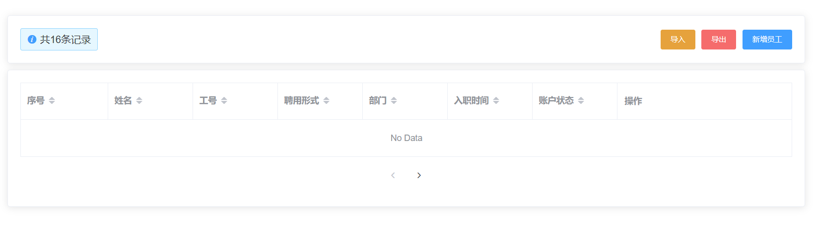
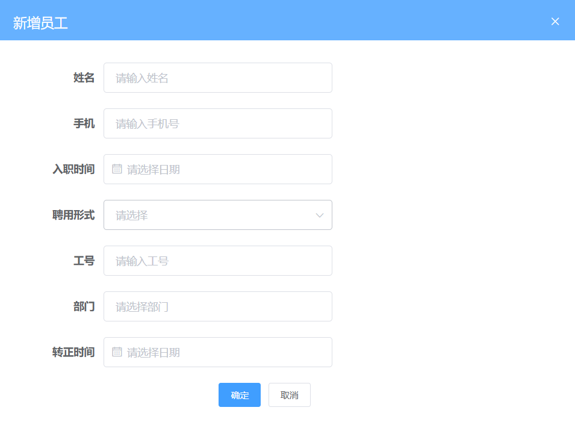
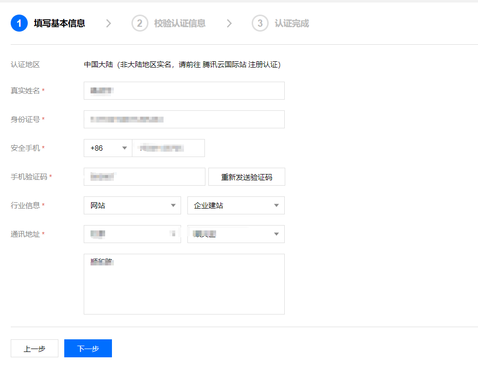
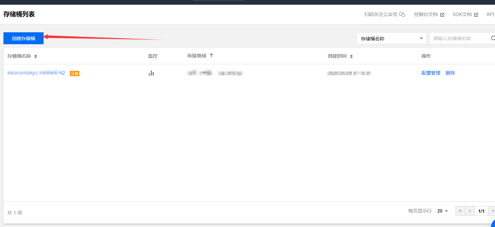
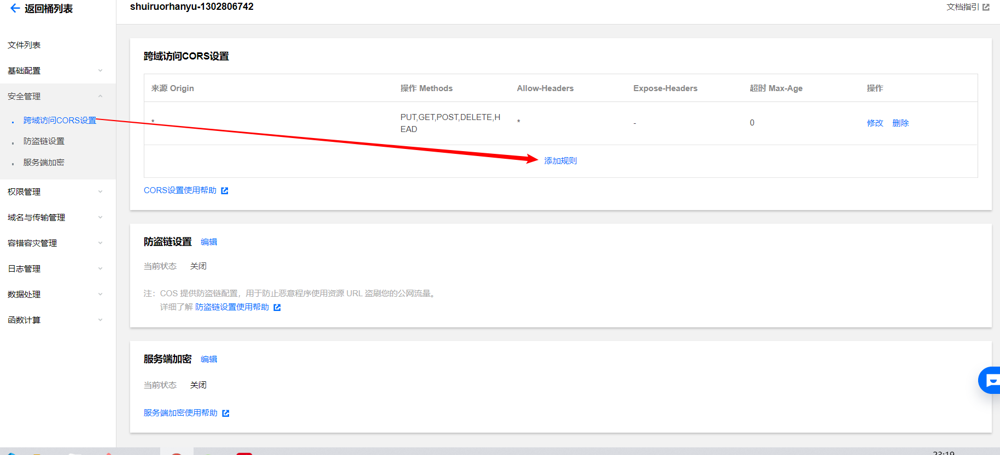
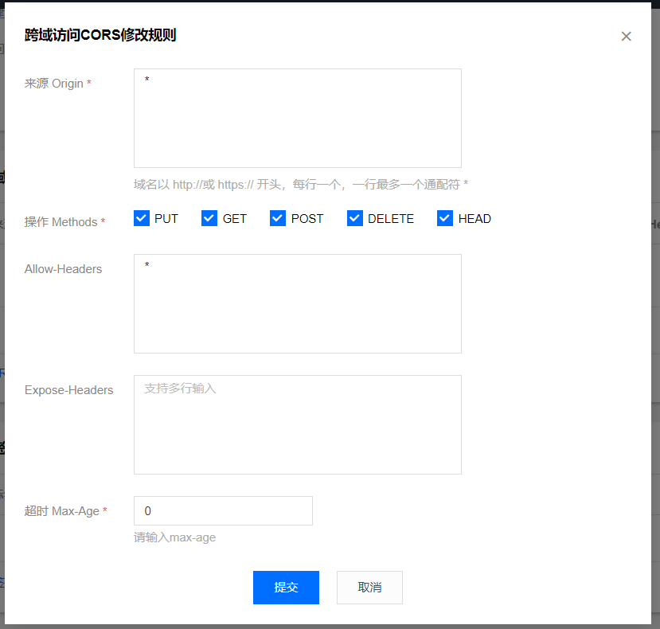
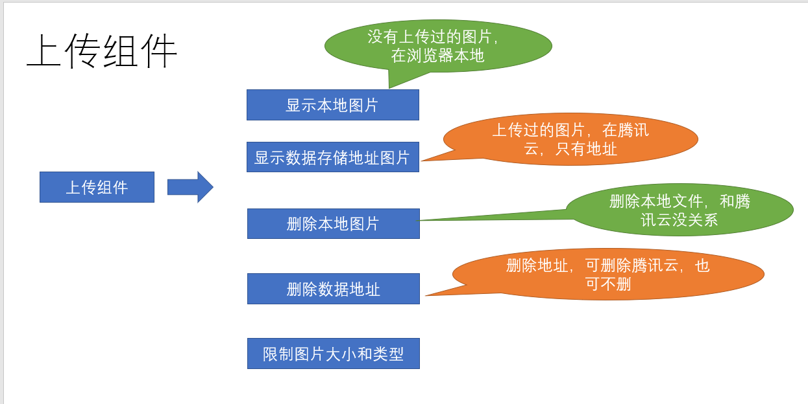

## 封装一个通用的工具栏

**`目标`**：封装一个通用的工具栏供大家使用

### 通用工具栏的组件结构

> 在后续的业务开发中，经常会用到一个类似下图的工具栏，作为公共组件，进行一下封装


组件 **`src/components/PageTools/index.vue`**

```vue
<template>
  <el-card class="page-tools">
    <el-row type="flex" justify="space-between" align="middle">
      <el-col>
        <div  v-if="showBefore" class="before">
          <i class="el-icon-info" />
          <!-- 定义前面得插槽 -->
          <slot name="before" />
        </div>
      </el-col>
      <el-col>
        <el-row type="flex" justify="end">
           <!-- 定义后面的插槽 -->
           <slot name="after" />
        </el-row>
      </el-col>
    </el-row>
  </el-card>
</template>

<script>
export default {
  props: {
    showBefore: {
      type: Boolean,
      default: false
    }

  }
}
</script>

<style lang='scss'>
 .page-tools {
    margin: 10px 0;
    .before {
      line-height: 34px;
    i {
      margin-right: 5px;
      color: #409eff;
    }
    display: inline-block;
    padding: 0px 10px;
    border-radius: 3px;
    border: 1px solid rgba(145, 213, 255, 1);
    background: rgba(230, 247, 255, 1);
  }
 }
</style>

```

### 组件统一注册

> 为了方便所有的页面都可以不用引用该组件，可以进行全局注册

提供注册入口 **`src/componets/index.js`**

```js
// 该文件负责所有的公共的组件的全局注册   Vue.use
import PageTools from './PageTools'
export default {
  install(Vue) {
    //  注册全局的通用栏组件对象
    Vue.component('PageTools', PageTools)
  }
}

```

> 在入口处进行注册 **`src/main.js`**

```js
import Component from '@/components'
Vue.use(Component) // 注册自己的插件
```

**提交代码**

**`本节任务`**： 封装一个通用的工具栏

## 员工列表页面的基本布局和结构

**`目标`**：实现员工列表页面的基本布局和结构

**结构代码** **`src/employees/index.vue`**

```vue
<template>
  <div class="dashboard-container">
    <div class="app-container">
      <page-tools :show-before="true">
        <span slot="before">共166条记录</span>
        <template slot="after">
          <el-button size="small" type="warning">导入</el-button>
          <el-button size="small" type="danger">导出</el-button>
          <el-button size="small" type="primary">新增员工</el-button>
        </template>
      </page-tools>
      <!-- 放置表格和分页 -->
      <el-card>
        <el-table border>
          <el-table-column label="序号" sortable="" />
          <el-table-column label="姓名" sortable="" />
          <el-table-column label="工号" sortable="" />
          <el-table-column label="聘用形式" sortable="" />
          <el-table-column label="部门" sortable="" />
          <el-table-column label="入职时间" sortable="" />
          <el-table-column label="账户状态" sortable="" />
          <el-table-column label="操作" sortable="" fixed="right" width="280">
            <template>
              <el-button type="text" size="small">查看</el-button>
              <el-button type="text" size="small">转正</el-button>
              <el-button type="text" size="small">调岗</el-button>
              <el-button type="text" size="small">离职</el-button>
              <el-button type="text" size="small">角色</el-button>
              <el-button type="text" size="small">删除</el-button>
            </template>
          </el-table-column>
        </el-table>
        <!-- 分页组件 -->
        <el-row type="flex" justify="center" align="middle" style="height: 60px">
          <el-pagination layout="prev, pager, next" />
        </el-row>
      </el-card>
    </div>
  </div>
</template>
```



**提交代码**

**`本节任务`**：员工列表页面的基本布局和结构

## 员工列表数据请求和分页加载

**`目标`**实现员工数据的加载和分页请求

首先，封装员工的加载请求 **`src/api/employees.js`**

```js
/**
 * 获取员工的综合列表数据
 * ***/
export function getEmployeeList(params) {
  return request({
    url: '/sys/user',
    params
  })
}

```

然后，实现加载数据和分页的逻辑

```js
import { getEmployeeList } from '@/api/employees'
export default {
  data() {
    return {
      loading: false,
      list: [], // 接数据的
      page: {
        page: 1, // 当前页码
        size: 10,
        total: 0 // 总数
      }

    }
  },
  created() {
    this.getEmployeeList()
  },
  methods: {
    changePage(newPage) {
      this.page.page = newPage
      this.getEmployeeList()
    },
    async getEmployeeList() {
      this.loading = true
      const { total, rows } = await getEmployeeList(this.page)
      this.page.total = total
      this.list = rows
      this.loading = false
    }
  }
}
```

**绑定表格**

```vue
      <el-card v-loading="loading">
        <el-table border :data="list">
          <el-table-column label="序号" sortable="" type="index" />
          <el-table-column label="姓名" sortable="" prop="username" />
          <el-table-column label="工号" sortable="" prop="workNumber" />
          <el-table-column label="聘用形式" sortable="" prop="formOfEmployment" />
          <el-table-column label="部门" sortable="" prop="departmentName" />
          <el-table-column label="入职时间" sortable="" prop="timeOfEntry" />
          <el-table-column label="账户状态" sortable="" prop="enableState" />
          <el-table-column label="操作" sortable="" fixed="right" width="280">
            <template>
              <el-button type="text" size="small">查看</el-button>
              <el-button type="text" size="small">转正</el-button>
              <el-button type="text" size="small">调岗</el-button>
              <el-button type="text" size="small">离职</el-button>
              <el-button type="text" size="small">角色</el-button>
              <el-button type="text" size="small">删除</el-button>
            </template>
          </el-table-column>
        </el-table>
        <!-- 分页组件 -->
        <el-row type="flex" justify="center" align="middle" style="height: 60px">
          <el-pagination
            layout="prev, pager, next"
            :page-size="page.size"
            :current-page="page.page"
            :total="page.total"
            @current-change="changePage"
          />
        </el-row>
      </el-card>
```

**提交代码**

**`本节任务`**员工列表数据请求和分页加载

## 员工列表中的数据进行格式化

**`目标`**：将列表中的内容进行格式化

### 利用列格式化属性处理聘用形式


> 上小节中，列表中的**聘用形式**/**入职时间**和**账户状态**需要进行显示内容的处理

那么聘用形式中**1**代表什么含义，这实际上是我们需要的枚举数据，该数据的存放文件位于我们提供的**`资源/枚举`**中，可以将枚举下的文件夹放于**`src/api`**文件夹下

针对**聘用形式**，可以使用**el-table-column**的**formatter**属性进行设置

```js
  import    EmployeeEnum from '@/api/constant/employees'
 <!-- 格式化聘用形式 -->
    <el-table-column label="聘用形式" sortable :formatter="formatEmployment" />
   // 格式化聘用形式
    formatEmployment(row, column, cellValue, index) {
      // 要去找 1所对应的值
      const obj = EmployeeEnum.hireType.find(item => item.id === cellValue)
      return obj ? obj.value : '未知'
    }
```

### 过滤器解决时间格式的处理

针对入职时间，我们可以采用**作用域插槽**进行处理

```vue
 <el-table-column label="入职时间" sortable prop="timeOfEntry">
            <template slot-scope="obj">
              {{
                obj.row.timeOfEntry | 过滤器
              }}
            </template>
  </el-table-column>
```

> 问题来了，过滤器从哪里呢？

在**`资源/过滤器`**中，我们提供了若干工具方法，我们可以将其转化成过滤器，首先将其拷贝到**`src`**

在**`main.js`**中将工具方法转化成过滤器

```js
import * as filters from '@/filters' // 引入工具类
// 注册全局的过滤器
Object.keys(filters).forEach(key => {
  // 注册过滤器
  Vue.filter(key, filters[key])
})
```

> 好了，现在可以愉快的用过滤器的方式使用工具类的方法了

```vue
       <el-table-column label="入职时间" sortable="" align="center">
            <!-- 作用域插槽 -->
            <template slot-scope="{ row }">{{ row.timeOfEntry | formatDate }}</template>
       </el-table-column>
```

最后一项，账户状态，可以用开关组件switch进行显示

```vue
 <el-table-column label="账户状态" align="center" sortable="" prop="enableState">
            <template slot-scope="{ row }">
              <!-- 根据当前状态来确定 是否打开开关 -->
              <el-switch :value="row.enableState === 1" />
            </template>
    </el-table-column>
```

**提交代码**

**`本节任务`** 员工列表中的数据进行格式化

## 删除员工功能

**`目标`**实现删除员工的功能

首先封装 删除员工的请求

```js
/**
 * 删除员工接口
 * ****/

export function delEmployee(id) {
  return request({
    url: `/sys/user/${id}`,
    method: 'delete'
  })
}
```

**删除功能**

```vue
 <template slot-scope="{ row }">
              <el-button type="text" size="small">查看</el-button>
              <el-button type="text" size="small">转正</el-button>
              <el-button type="text" size="small">调岗</el-button>
              <el-button type="text" size="small">离职</el-button>
              <el-button type="text" size="small">角色</el-button>
              <el-button type="text" size="small" @click="deleteEmployee(row.id)">删除</el-button>
            </template> 
    // 删除员工
    async deleteEmployee(id) {
      try {
        await this.$confirm('您确定删除该员工吗')
        await delEmployee(id)
        this.getEmployeeList()
        this.$message.success('删
除员工成功')
      } catch (error) {
        console.log(error)
      }
    }
```

**提交代码**

**`本节任务`**： 删除员工功能

## 新增员工功能-弹层-校验-部门

**`目标`**：实现新增员工的功能

### 新建员工弹层组件

> 当我们点击新增员工时，我们需要一个类似的弹层



类似**`组织架构`**的组件，同样新建一个弹层组件 **`src/views/employees/components/add-employee.vue`**

```vue
<template>
  <el-dialog title="新增员工" :visible="showDialog">
    <!-- 表单 -->
    <el-form label-width="120px">
      <el-form-item label="姓名">
        <el-input style="width:50%" placeholder="请输入姓名" />
      </el-form-item>
      <el-form-item label="手机">
        <el-input style="width:50%" placeholder="请输入手机号" />
      </el-form-item>
      <el-form-item label="入职时间">
        <el-date-picker style="width:50%" placeholder="请选择入职时间" />
      </el-form-item>
      <el-form-item label="聘用形式">
        <el-select style="width:50%" placeholder="请选择" />
      </el-form-item>
      <el-form-item label="工号">
        <el-input style="width:50%" placeholder="请输入工号" />
      </el-form-item>
      <el-form-item label="部门">
        <el-input style="width:50%" placeholder="请选择部门" />
      </el-form-item>
      <el-form-item label="转正时间">
        <el-date-picker style="width:50%" placeholder="请选择转正时间" />
      </el-form-item>
    </el-form>
    <!-- footer插槽 -->
    <template v-slot:footer>
      <el-row type="flex" justify="center">
        <el-col :span="6">
          <el-button size="small">取消</el-button>
          <el-button type="primary" size="small">确定</el-button>
        </el-col>
      </el-row>
    </template>
  </el-dialog>
</template>

<script>
export default {
  props: {
    showDialog: {
      type: Boolean,
      default: false
    }
  }
}
</script>

<style>

</style>

```

### 引用弹出层，点击弹出

父组件中引用，弹出层

```vue
import AddDemployee from './components/add-employee'
<!-- 放置新增组件 -->
 <add-employee :show-dialog.sync="showDialog" />
```


```vue
<!-- 放置新增组件 -->
 <add-employee :show-dialog.sync="showDialog" />

 <el-button icon="plus" type="primary" size="small" @click="showDialog = true">新增员工</el-button>

```

### 新增员工的表单校验

**封装新增员工**api **`src/api/employees.js`**

```js
/** **
 *  新增员工的接口
 * **/
export function addEmployee(data) {
  return request({
    method: 'post',
    url: '/sys/user',
    data
  })
}

```

针对员工属性，添加校验规则

```js
import EmployeeEnum from '@/api/constant/employees'

  data() {
    return {
      EmployeeEnum, // 在data中定义数据
      // 表单数据
      treeData: [], // 定义数组接收树形数据
      showTree: false, // 控制树形的显示或者隐藏
      loading: false, // 控制树的显示或者隐藏进度条
      formData: {
        username: '',
        mobile: '',
        formOfEmployment: '',
        workNumber: '',
        departmentName: '',
        timeOfEntry: '',
        correctionTime: ''
      },
      rules: {
        username: [{ required: true, message: '用户姓名不能为空', trigger: 'blur' }, {
          min: 1, max: 4, message: '用户姓名为1-4位'
        }],
        mobile: [{ required: true, message: '手机号不能为空', trigger: 'blur' }, {
          pattern: /^1[3-9]\d{9}$/, message: '手机号格式不正确', trigger: 'blur'
        }],
        formOfEmployment: [{ required: true, message: '聘用形式不能为空', trigger: 'blur' }],
        workNumber: [{ required: true, message: '工号不能为空', trigger: 'blur' }],
        departmentName: [{ required: true, message: '部门不能为空', trigger: 'change' }],
        timeOfEntry: [{ required: true, message: '入职时间', trigger: 'blur' }]
      }
    }
  }
```

绑定数据和规则校验

```vue
    <el-form :model="formData" :rules="rules" label-width="120px">
      <el-form-item label="姓名" prop="username">
        <el-input v-model="formData.username" style="width:50%" placeholder="请输入姓名" />
      </el-form-item>
      <el-form-item label="手机" prop="mobile">
        <el-input v-model="formData.mobile" style="width:50%" placeholder="请输入手机号" />
      </el-form-item>
      <el-form-item label="入职时间" prop="timeOfEntry">
        <el-date-picker v-model="formData.timeOfEntry" style="width:50%" placeholder="请选择日期" />
      </el-form-item>
      <el-form-item label="聘用形式" prop="formOfEmployment">
        <el-select v-model="formData.formOfEmployment" style="width:50%" placeholder="请选择" />
      </el-form-item>
      <el-form-item label="工号" prop="workNumber">
        <el-input v-model="formData.workNumber" style="width:50%" placeholder="请输入工号" />
      </el-form-item>
      <el-form-item label="部门" prop="departmentName">
        <el-input v-model="formData.departmentName" style="width:50%" placeholder="请选择部门" />
      </el-form-item>
      <el-form-item label="转正时间" prop="correctionTime">
        <el-date-picker v-model="formData.correctionTime" style="width:50%" placeholder="请选择日期" />
      </el-form-item>
    </el-form>
```

### 加载部门数据转化树形

**聘用形式和选择部门的处理**

>  员工的部门是从树形部门中选择一个部门

**获取部门数据，转化树形**

```js
import { getDepartments } from '@/api/departments'
import { transListToTreeData } from '@/utils'
  data () {
      return {
             // 表单数据
       treeData: [], // 定义数组接收树形数据
       showTree: false, // 控制树形的显示或者隐藏
       loading: false, // 控制树的显示或者隐藏进度条
      }
  },
  methods: {
      async getDepartments() {
      this.showTree = true
      this.loading = true
      const { depts } = await getDepartments()
      // depts是数组 但不是树形
      this.treeData = transListToTreeData(depts, '')
      this.loading = false
    },
  }
```

### 点击部门赋值表单数据

**选择部门，赋值表单数据**

```vue
<el-form-item label="部门" prop="departmentName">
        <el-input v-model="formData.departmentName" style="width:50%" placeholder="请选择部门" @focus="getDepartments" />
        <!-- 放置一个tree组件 -->
        <el-tree
          v-if="showTree"
          v-loading="loading"
          :data="treeData"
          default-expand-all=""
          :props="{ label: 'name' }"
          @node-click="selectNode"
        />
      </el-form-item>
```


**点击部门时触发**

```js
    selectNode(node) {
      this.formData.departmentName = node.name
      this.showTree = false
    }
```

**聘用形式**

```vue
    <el-form-item label="聘用形式" prop="formOfEmployment">
        <el-select v-model="formData.formOfEmployment" style="width:50%" placeholder="请选择">
          <!-- 遍历只能遍历组件的数据 -->
          <el-option v-for="item in EmployeeEnum.hireType" :key="item.id" :label="item.value" :value="item.id" />
        </el-select>
      </el-form-item>
```


## 新增员工功能-确定-取消

**调用新增接口**

```js
    // 点击确定时 校验整个表单
    async btnOK() {
      try {
        await this.$refs.addEmployee.validate()
        // 调用新增接口
        await addEmployee(this.formData) // 新增员工
        // 告诉父组件更新数据
        // this.$parent 可以直接调用到父组件的实例 实际上就是父组件this
        // this.$emit
        this.$parent.getEmployeeList()
        this.$parent.showDialog = false
      } catch (error) {
        console.log(error)
      }
    },
    btnCancel() {
      // 重置原来的数据
      this.formData = {
        username: '',
        mobile: '',
        formOfEmployment: '',
        workNumber: '',
        departmentName: '',
        timeOfEntry: '',
        correctionTime: ''
      }
      this.$refs.addEmployee.resetFields() // 重置校验结果
      this.$emit('update:showDialog', false)
    }
```

> 新增员工的功能和组织架构的功能极其类似，这里不做过多阐述

**提交代码**

**`本节任务`** 新增员工功能和弹层

## 员工导入组件封装

**`目标`**：封装一个导入excel数据的文件


首先封装一个类似的组件，首先需要注意的是，类似功能，vue-element-admin已经提供了，我们只需要改造即可 [代码地址](https://github.com/PanJiaChen/vue-element-admin/blob/master/src/components/UploadExcel/index.vue)

> 类似功能性的组件，我们只需要会使用和封装即可 

excel导入功能需要使用npm包**`xlsx`**，所以需要安装**`xlsx`**插件

```bash
$ npm i xlsx
```

> 将vue-element-admin提供的导入功能新建一个组件，位置： **`src/components/UploadExcel`**

**注册全局的导入excel组件**

```js
import PageTools from './PageTools'
import UploadExcel from './UploadExcel'
export default {
  install(Vue) {
    Vue.component('PageTools', PageTools) // 注册工具栏组件
    Vue.component('UploadExcel', UploadExcel) // 注册导入excel组件
  }
}
```

**修改样式和布局**

```vue
<template>
 <div class="upload-excel">
    <div class="btn-upload">
      <el-button :loading="loading" size="mini" type="primary" @click="handleUpload">
        点击上传
      </el-button>
    </div>

    <input ref="excel-upload-input" class="excel-upload-input" type="file" accept=".xlsx, .xls" @change="handleClick">
    <div class="drop" @drop="handleDrop" @dragover="handleDragover" @dragenter="handleDragover">
      <i class="el-icon-upload" />
      <span>将文件拖到此处</span>
    </div>
  </div>
</template>
<style scoped lang="scss">
.upload-excel {
  display: flex;
  justify-content: center;
   margin-top: 100px;
   .excel-upload-input{
       display: none;
        z-index: -9999;
     }
   .btn-upload , .drop{
      border: 1px dashed #bbb;
      width: 350px;
      height: 160px;
      text-align: center;
      line-height: 160px;
   }
   .drop{
       line-height: 80px;
       color: #bbb;
      i {
        font-size: 60px;
        display: block;
      }
   }
}
</style>
```

**提交代码**

**`本节任务`**：员工导入组件封装

## 员工的导入

**`目标`**：实现员工的导入

### 建立公共导入的页面路由

**新建一个公共的导入页面，挂载路由** **`src/router/index.js`**

```js
{
    path: '/import',
    component: Layout,
    hidden: true, // 隐藏在左侧菜单中
    children: [{
      path: '', // 二级路由path什么都不写 表示二级默认路由
      component: () => import('@/views/import')
    }]
  },
```

**创建import路由组件** **`src/views/import/index.vue`**

```vue
<template>
  <!-- 公共导入组件 --> 
  <upload-excel :on-success="success" />
</template>

```

### 分析excel导入代码，封装接口

> 封装导入员工的api接口  

```js
/** *
 *  封装一个导入员工的接口
 *
 * ***/

export function importEmployee(data) {
  return request({
    url: '/sys/user/batch',
    method: 'post',
    data
  })
}
```

### 实现excel导入

**获取导入的excel数据, 导入excel接口**

```js
    async  success({ header, results }) {
      // 如果是导入员工
        const userRelations = {
          '入职日期': 'timeOfEntry',
          '手机号': 'mobile',
          '姓名': 'username',
          '转正日期': 'correctionTime',
          '工号': 'workNumber'
        }
        const arr = []
       results.forEach(item => {
          const userInfo = {}
          Object.keys(item).forEach(key => {
            userInfo[userRelations[key]] = item[key]
          })
         arr.push(userInfo) 
        })
        await importEmployee(arr) // 调用导入接口
        this.$router.back()
    }
```

> 为了让这个页面可以服务更多的导入功能，我们可以在页面中用参数来判断，是否是导入员工

```js
 data() {
    return {
      type: this.$route.query.type
    }
  },
```

当excel中有日期格式的时候，实际转化的值为一个数字，我们需要一个方法进行转化

```js
    formatDate(numb, format) {
      const time = new Date((numb - 1) * 24 * 3600000 + 1)
      time.setYear(time.getFullYear() - 70)
      const year = time.getFullYear() + ''
      const month = time.getMonth() + 1 + ''
      const date = time.getDate() - 1 + ''
      if (format && format.length === 1) {
        return year + format + month + format + date
      }
      return year + (month < 10 ? '0' + month : month) + (date < 10 ? '0' + date : date)
    }
```

> 需要注意，**`导入的手机号不能和之前的存在的手机号重复`**

**逻辑判断** 

```js
 async  success({ header, results }) {
      if (this.type === 'user') {
        const userRelations = {
          '入职日期': 'timeOfEntry',
          '手机号': 'mobile',
          '姓名': 'username',
          '转正日期': 'correctionTime',
          '工号': 'workNumber'
        }
        const arr = []
        // 遍历所有的数组
        results.forEach(item => {
        // 需要将每一个条数据里面的中文都换成英文
          const userInfo = {}
          Object.keys(item).forEach(key => {
          // key是当前的中文名 找到对应的英文名
            if (userRelations[key] === 'timeOfEntry' || userRelations[key] === 'correctionTime') {
              userInfo[userRelations[key]] = new Date(this.formatDate(item[key], '/')) // 只有这样, 才能入库
              return
            }
            userInfo[userRelations[key]] = item[key]
          })
          // 最终userInfo变成了全是英文
          arr.push(userInfo)
        })
        await importEmployee(arr)
        this.$message.success('导入成功')
      }
      this.$router.back() // 回到上一页
    },
    formatDate(numb, format) {
      const time = new Date((numb - 1) * 24 * 3600000 + 1)
      time.setYear(time.getFullYear() - 70)
      const year = time.getFullYear() + ''
      const month = time.getMonth() + 1 + ''
      const date = time.getDate() - 1 + ''
      if (format && format.length === 1) {
        return year + format + month + format + date
      }
      return year + (month < 10 ? '0' + month : month) + (date < 10 ? '0' + date : date)
    }
```

**员工页面跳转**

```vue
<el-button type="warning" size="small" @click="$router.push('/import?type=user')">导入</el-button>

```

**`目标`**： 实现员工的导入

## 员工导出excel功能

**目标**： 实现将员工数据导出功能

> 日常业务中，我们经常遇到excel导出功能， 怎么使用呢

Excel 的导入导出都是依赖于[js-xlsx](https://github.com/SheetJS/js-xlsx)来实现的。

在 `js-xlsx`的基础上又封装了[Export2Excel.js](https://github.com/PanJiaChen/vue-element-admin/blob/master/src/vendor/Export2Excel.js)来方便导出数据。

### 安装excel所需依赖和按需加载

由于 `Export2Excel`不仅依赖`js-xlsx`还依赖`file-saver`和`script-loader`。

所以你先需要安装如下命令：

```bash
npm install xlsx file-saver -S
npm install script-loader -S -D
```

由于`js-xlsx`体积还是很大的，导出功能也不是一个非常常用的功能，所以使用的时候建议使用懒加载。使用方法如下：

```js
import('@/vendor/Export2Excel').then(excel => {
  excel.export_json_to_excel({
    header: tHeader, //表头 必填
    data, //具体数据 必填
    filename: 'excel-list', //非必填
    autoWidth: true, //非必填
    bookType: 'xlsx' //非必填
  })
})
```

### excel导出参数的介绍

> vue-element-admin提供了导出的功能模块，在课程资源/excel导出目录下，放置到src目录下

**参数**

| 参数      | 说明                   | 类型    | 可选值                                                       | 默认值     |
| --------- | ---------------------- | ------- | ------------------------------------------------------------ | ---------- |
| header    | 导出数据的表头         | Array   | /                                                            | []         |
| data      | 导出的具体数据         | Array   | /                                                            | [[]]       |
| filename  | 导出文件名             | String  | /                                                            | excel-list |
| autoWidth | 单元格是否要自适应宽度 | Boolean | true / false                                                 | true       |
| bookType  | 导出文件类型           | String  | xlsx, csv, txt, [more](https://github.com/SheetJS/js-xlsx#supported-output-formats) | xlsx       |

### excel导出基本的结构

> 我们最重要的一件事，就是把表头和数据进行相应的对应

因为数据中的key是英文，想要导出的表头是中文的话，需要将中文和英文做对应

```js
   const headers = {
        '手机号': 'mobile',
        '姓名': 'username',
        '入职日期': 'timeOfEntry',
        '聘用形式': 'formOfEmployment',
        '转正日期': 'correctionTime',
        '工号': 'workNumber',
        '部门': 'departmentName'
      }
```

然后，**完成导出代码**

```js
    // 导出excel数据
    exportData() {
      //  做操作
      // 表头对应关系
      const headers = {
        '姓名': 'username',
        '手机号': 'mobile',
        '入职日期': 'timeOfEntry',
        '聘用形式': 'formOfEmployment',
        '转正日期': 'correctionTime',
        '工号': 'workNumber',
        '部门': 'departmentName'
      }
      // 懒加载
      import('@/vendor/Export2Excel').then(async excel => {
        const { rows } = await getEmployeeList({ page: 1, size: this.page.total })
        const data = this.formatJson(headers, rows)

        excel.export_json_to_excel({
          header: Object.keys(headers),
          data,
          filename: '员工信息表',
          autoWidth: true,
          bookType: 'xlsx'

        })
        // 获取所有的数据

        // excel.export_json_to_excel({
        //   header: ['姓名', '薪资'],
        //   data: [['张三', 12000], ['李四', 5000]],
        //   filename: '员工薪资表',
        //   autoWidth: true,
        //   bookType: 'csv'
        // })
      })
    },
    // 该方法负责将数组转化成二维数组
    formatJson(headers, rows) {
      // 首先遍历数组
      // [{ username: '张三'},{},{}]  => [[’张三'],[],[]]
      return rows.map(item => {
        return Object.keys(headers).map(key => {
          if (headers[key] === 'timeOfEntry' || headers[key] === 'correctionTime') {
            return formatDate(item[headers[key]]) // 返回格式化之前的时间
          } else if (headers[key] === 'formOfEmployment') {
            var en = EmployeeEnum.hireType.find(obj => obj.id === item[headers[key]])
            return en ? en.value : '未知'
          }
          return item[headers[key]]
        }) // => ["张三", "13811"，"2018","1", "2018", "10002"]
      })
      // return data
      // return rows.map(item => {
      //   // item是对象  => 转化成只有值的数组 => 数组值的顺序依赖headers  {username: '张三'  }
      //   // Object.keys(headers)  => ["姓名", "手机号",...]
      //   return Object.keys(headers).map(key => {
      //     return item[headers[key]]
      //   }) // /  得到 ['张三'，’129‘，’dd‘,'dd']
      // })
    }
```

### 导出时间格式的处理

```js
    formatJson(headers, rows) {
      return rows.map(item => {
        // item是一个对象  { mobile: 132111,username: '张三'  }
        // ["手机号", "姓名", "入职日期" 。。]
        return Object.keys(headers).map(key => {
          // 需要判断 字段
          if (headers[key] === 'timeOfEntry' || headers[key] === 'correctionTime') {
            // 格式化日期
            return formatDate(item[headers[key]])
          } else if (headers[key] === 'formOfEmployment') {
            const obj = EmployeeEnum.hireType.find(obj => obj.id === item[headers[key]])
            return obj ? obj.value : '未知'
          }
          return item[headers[key]]
        })
        // ["132", '张三’， ‘’，‘’，‘’d]
      })
      // return rows.map(item => Object.keys(headers).map(key => item[headers[key]]))
      // 需要处理时间格式问题
    }
```


### **`扩展`**  复杂表头的导出

> 当需要导出复杂表头的时候，vue-element-admin同样支持该类操作

**vue-element-admin** 提供的导出方法中有 **multiHeader**和**merges** 的参数

| 参数        | 说明           | 类型  | 可选值 | 默认值 |
| ----------- | -------------- | ----- | ------ | ------ |
| multiHeader | 复杂表头的部分 | Array | /      | [[]]   |
| merges      | 需要合并的部分 | Array | /      | []     |

multiHeader里面是一个二维数组，里面的一个元素是一行表头，假设你想得到一个如图的结构


mutiHeader应该这样定义

```js
const multiHeader = [['姓名', '主要信息', '', '', '', '', '部门']]
```

multiHeader中的一行表头中的字段的个数需要和真正的列数相等，假设想要跨列，多余的空间需要定义成空串

它主要对应的是标准的表头

```js
const header = ['姓名', '手机号', '入职日期', '聘用形式', '转正日期', '工号', '部门']
```

如果，我们要实现其合并的效果， 需要设定merges选项

```js
 const merges = ['A1:A2', 'B1:F1', 'G1:G2']
```

merges的顺序是没关系的，只要配置这两个属性，就可以导出复杂表头的excel了

```js
  exportData() {
      const headers = {
        '姓名': 'username',
        '手机号': 'mobile',
        '入职日期': 'timeOfEntry',
        '聘用形式': 'formOfEmployment',
        '转正日期': 'correctionTime',
        '工号': 'workNumber',
        '部门': 'departmentName'
      }
      // 导出excel
      import('@/vendor/Export2Excel').then(async excel => {
        //  excel是引入文件的导出对象
        // 导出  header从哪里来
        // data从哪里来
        // 现在没有一个接口获取所有的数据
        // 获取员工的接口 页码 每页条数    100   1 10000
        const { rows } = await getEmployeeList({ page: 1, size: this.page.total })
        const data = this.formatJson(headers, rows) // 返回的data就是 要导出的结构
        const multiHeader = [['姓名', '主要信息', '', '', '', '', '部门']]
        const merges = ['A1:A2', 'B1:F1', 'G1:G2']
        excel.export_json_to_excel({
          header: Object.keys(headers),
          data,
          filename: '员工资料表',
          multiHeader, // 复杂表头
          merges // 合并选项
        })

        // excel.export_json_to_excel({
        //   header: ['姓名', '工资'],
        //   data: [['张三', 3000], ['李四', 5000]],
        //   filename: '员工工资表'
        // })
        // [{ username: '张三',mobile: 13112345678 }]  => [[]]
        // 要转化 数据结构 还要和表头的顺序对应上
        // 要求转出的标题是中文
      })
    },
    // 将表头数据和数据进行对应
    // [{}]  =>   [[]]
    formatJson(headers, rows) {
      return rows.map(item => {
        // item是一个对象  { mobile: 132111,username: '张三'  }
        // ["手机号", "姓名", "入职日期" 。。]
        return Object.keys(headers).map(key => {
          // 需要判断 字段
          if (headers[key] === 'timeOfEntry' || headers[key] === 'correctionTime') {
            // 格式化日期
            return formatDate(item[headers[key]])
          } else if (headers[key] === 'formOfEmployment') {
            const obj = EmployeeEnum.hireType.find(obj => obj.id === item[headers[key]])
            return obj ? obj.value : '未知'
          }
          return item[headers[key]]
        })
        // ["132", '张三’， ‘’，‘’，‘’d]
      })
      // return rows.map(item => Object.keys(headers).map(key => item[headers[key]]))
      // 需要处理时间格式问题
    }
```

**提交代码**

**`本节任务`**实现将员工数据导出功能

## 员工详情页创建和布局

**`目标`**：创建员工详情的主要布局页面和基本布局

### 详情页的基本布局和路由


**建立详情页路由**

```js
{
    path: 'detail/:id', // query传参 动态路由传参
    component: () => import('@/views/employees/detail'),
    hidden: true, // 不在左侧菜单显示
    meta: {
      title: '员工详情' // 标记当前路由规则的中文名称 后续在做左侧菜单时 使用
    }
  }
```

**建立基本架构**

```vue
<div class="dashboard-container">
    <div class="app-container">
      <el-card>
        <el-tabs>
          <el-tab-pane label="登录账户设置">

            <!-- 放置表单 -->
            <el-form label-width="120px" style="margin-left: 120px; margin-top:30px">
              <el-form-item label="姓名:">
                <el-input style="width:300px" />
              </el-form-item>
              <el-form-item label="密码:">
                <el-input style="width:300px" type="password" />
              </el-form-item>
              <el-form-item>
                <el-button type="primary">更新</el-button>
              </el-form-item>
            </el-form>
          </el-tab-pane>
          <el-tab-pane label="个人详情" />
          <el-tab-pane label="岗位信息" />
        </el-tabs>
      </el-card>
    </div>
  </div>
```

**列表跳转到详情**

```vue
<el-button type="text" size="small" @click="$router.push(`/employees/detail/${obj.row.id}`)">查看</el-button>

```

### 读取和保存用户信息的接口

**加载个人基本信息** > 该接口已经在之前提供过了 **`src/api/user.js`**

```js
/** *
 *  获取某个用户的基本信息
 *
 * ***/
export function getUserDetailById(id) {
  return request({
    url: `/sys/user/${id}`
  })
}

```

**保存个人基本信息**  **`src/api/employees.js`**

```js
/** *
 *
 * 保存员工的基本信息
 * **/
export function saveUserDetailById(data) {
  return request({
    url: `/sys/user/${data.id}`,
    method: 'put',
    data
  })
}

```

### 实现用户名和密码的修改

**`注意`**：这里有个缺陷，接口中读取的是后端的密文，我们并不能解密，所以当我们没有任何修改就保存时，会校验失败，因为密文超过了规定的12位长度，为了真的修改密码，我们设定了一个临时的字段 **password2**，用它来存储我们的修改值，最后保存的时候，把**password2**传给**password**

**用户名和密码的修改**  **`src/views/employees/detail.vue`**

```js
import { getUserDetailById } from '@/api/user'
import { saveUserDetailById } from '@/api/employees'
export default {
  data() {
    return {
      userId: this.$route.params.id, // 这样可以后面直接通过 this.userId进行获取数据
      userInfo: {
        //   专门存放基本信息
        username: '',
        password2: ''
      },
      rules: {
        username: [{ required: true, message: '姓名不能为空', trigger: 'blur' }],
        password2: [{ required: true, message: '密码不能为空', trigger: 'blur' },
          { min: 6, max: 9, message: '密码长度6-9位', trigger: 'blur' }]
      }
    }
  },
  created() {
    this.getUserDetailById()
  },
  methods: {
    async getUserDetailById() {
      this.userInfo = await getUserDetailById(this.userId)
    },
    async saveUser() {
      try {
        // 校验
        await this.$refs.userForm.validate()
        await saveUserDetailById({ ...this.userInfo, password: this.userInfo.password2 }) // 将新密码的值替换原密码的值
        this.$message.success('保存成功')
      } catch (error) {
        console.log(error)
      }
    }
  }
}
```

**绑定表单数据**

```vue
 <!-- 放置表单 -->
            <el-form ref="userForm" :model="userInfo" :rules="rules" label-width="120px" style="margin-left: 120px; margin-top:30px">
              <el-form-item label="姓名:" prop="username">
                <el-input v-model="userInfo.username" style="width:300px" />
              </el-form-item>
              <el-form-item label="新密码:" prop="password2">
                <el-input v-model="userInfo.password2" style="width:300px" type="password" />
              </el-form-item>
              <el-form-item>
                <el-button type="primary" @click="saveUser">更新</el-button>
              </el-form-item>
            </el-form>
```

**提交代码**


## 个人组件和岗位组件封装

### 封装个人详情组件

> 我们将员工个人信息分为三部分，账户，个人， 岗位，这个小节我们对个人组件和岗位组件进行封装


**封装个人组件**   **`src/views/employees/components/user-info.vue`**

```vue
<template>
  <div class="user-info">
    <!-- 个人信息 -->
    <el-form label-width="220px">
      <!-- 工号 入职时间 -->
      <el-row class="inline-info">
        <el-col :span="12">
          <el-form-item label="工号">
            <el-input v-model="userInfo.workNumber" class="inputW" />
          </el-form-item>
        </el-col>
        <el-col :span="12">
          <el-form-item label="入职时间">
            <el-date-picker
              v-model="userInfo.timeOfEntry"
              type="date"
              class="inputW"
              value-format="YYYY-MM-DD"
            />
          </el-form-item>
        </el-col>
      </el-row>
      <!-- 姓名 部门 -->
      <el-row class="inline-info">
        <el-col :span="12">
          <el-form-item label="姓名">
            <el-input v-model="userInfo.username" class="inputW" />
          </el-form-item>
        </el-col>
        <el-col :span="12">
          <el-form-item label="部门">
            <el-input v-model="userInfo.departmentName" class="inputW" />
          </el-form-item>
        </el-col>
      </el-row>
      <!--手机 聘用形式  -->
      <el-row class="inline-info">
        <el-col :span="12">
          <el-form-item label="手机">
            <el-input v-model="userInfo.mobile" />
          </el-form-item>
        </el-col>
        <el-col :span="12">
          <el-form-item label="聘用形式">
            <el-select v-model="userInfo.formOfEmployment" class="inputW">
              <el-option
                v-for="item in EmployeeEnum.hireType"
                :key="item.id"
                :label="item.value"
                :value="item.id"
              />
            </el-select>
          </el-form-item>
        </el-col>
      </el-row>
      <!-- 员工照片 -->
      <el-row class="inline-info">
        <el-col :span="12">
          <el-form-item label="员工头像">
            <!-- 放置上传图片 -->
           
          </el-form-item>
        </el-col>
      </el-row>
      <!-- 保存个人信息 -->
      <el-row class="inline-info" type="flex" justify="center">
        <el-col :span="12">
          <el-button type="primary" @click="saveUser">保存更新</el-button>
          <el-button @click="$router.back()">返回</el-button>

        </el-col>
      </el-row>
    </el-form>
    <!-- 基础信息 -->
    <el-form label-width="220px">
      <div class="block">
        <div class="title">基础信息</div>
        <el-form-item label="最高学历">
          <el-select v-model="formData.theHighestDegreeOfEducation" class="inputW2">
            <el-option
              v-for="item in EmployeeEnum.highestDegree"
              :key="item.value"
              :label="item.label"
              :value="item.value"
            />
          </el-select>
        </el-form-item>
        <!-- 个人头像 -->
        <!-- 员工照片 -->

        <el-form-item label="员工照片">
          <!-- 放置上传图片 -->
        </el-form-item>
        <el-form-item label="国家/地区">
          <el-select v-model="formData.nationalArea" class="inputW2">
            <el-option
              v-for="item in EmployeeEnum.isOverseas"
              :key="item.value"
              :label="item.label"
              :value="item.value"
            />
          </el-select>
        </el-form-item>
        <el-form-item label="护照号">
          <el-input v-model="formData.passportNo" placeholder="正规护照格式" class="inputW" />
        </el-form-item>
        <el-form-item label="身份证号">
          <el-input v-model="formData.idNumber" placeholder="正规身份证格式" class="inputW" />
        </el-form-item>
        <el-form-item label="籍贯">
          <el-input v-model="formData.nativePlace" placeholder="籍贯地址" class="inputW5" />
        </el-form-item>
        <el-form-item label="民族">
          <el-input v-model="formData.nation" placeholder="请输入民族" class="inputW2" />
        </el-form-item>
        <el-form-item label="婚姻状况">
          <el-select v-model="formData.maritalStatus" class="inputW2">
            <el-option
              v-for="item in EmployeeEnum.maritaStatus"
              :key="item.value"
              :label="item.label"
              :value="item.value"
            />
          </el-select>
        </el-form-item>
        <el-form-item label="生日">
          <el-input v-model="formData.birthday" placeholder="示例 0323" class="inputW" />
        </el-form-item>
        <el-form-item label="年龄">
          <el-input v-model="formData.age" type="number" class="inputW2" />
        </el-form-item>
        <el-form-item label="星座">
          <el-select v-model="formData.constellation" class="inputW2">
            <el-option
              v-for="item in EmployeeEnum.constellation"
              :key="item.value"
              :label="item.label"
              :value="item.value"
            />
          </el-select>
        </el-form-item>
        <el-form-item label="血型">
          <el-select v-model="formData.bloodType" class="inputW2">
            <el-option
              v-for="item in EmployeeEnum.bloodType"
              :key="item.value"
              :label="item.label"
              :value="item.value"
            />
          </el-select>
        </el-form-item>
        <el-form-item label="户籍所在地">
          <el-input v-model="formData.domicile" class="inputW5" />
        </el-form-item>
        <el-form-item label="政治面貌">
          <el-input v-model="formData.politicalOutlook" class="inputW2" />
        </el-form-item>
        <el-form-item label="入党时间">
          <el-date-picker
            v-model="formData.timeToJoinTheParty"
            type="date"
            placeholder="选择日期"
            class="inputW"
            value-format="yyyy-MM-dd"
          />
        </el-form-item>
        <el-form-item label="存档机构">
          <el-input v-model="formData.archivingOrganization" placeholder="请输入" />
        </el-form-item>
        <el-form-item label="子女状态">
          <el-input v-model="formData.stateOfChildren" placeholder="请输入" />
        </el-form-item>
        <el-form-item label="子女有无商业险">
          <el-radio-group v-model="formData.doChildrenHaveCommercialInsurance">
            <el-radio label="1">有</el-radio>
            <el-radio label="2">无</el-radio>
          </el-radio-group>
        </el-form-item>
        <el-form-item label="有无违法违纪状态">
          <el-input v-model="formData.isThereAnyViolationOfLawOrDiscipline" placeholder="请输入" />
        </el-form-item>
        <el-form-item label="有无重大病史">
          <el-input v-model="formData.areThereAnyMajorMedicalHistories" placeholder="请输入" />
        </el-form-item>
      </div>
      <!-- 通讯信息 -->
      <div class="block">
        <div class="title">通讯信息</div>
        <el-form-item label="QQ">
          <el-input v-model="formData.qq" placeholder="请输入" class="inputW" />
        </el-form-item>
        <el-form-item label="微信">
          <el-input v-model="formData.wechat" placeholder="请输入" class="inputW" />
        </el-form-item>
        <el-form-item label="现居住地">
          <el-input v-model="formData.placeOfResidence" placeholder="请输入" />
        </el-form-item>
        <el-form-item label="通讯地址">
          <el-input v-model="formData.postalAddress" placeholder="请输入" />
        </el-form-item>
        <el-form-item label="联系手机">
          <el-input v-model="formData.contactTheMobilePhone" placeholder="11位字符" maxlength="11" class="inputW" @change.native="handlePhone(2)" />
        </el-form-item>
        <el-form-item label="个人邮箱">
          <el-input v-model="formData.personalMailbox" placeholder="请输入" type="mail" class="inputW" />
        </el-form-item>
        <el-form-item label="紧急联系人">
          <el-input v-model="formData.emergencyContact" placeholder="请输入" class="inputW" />
        </el-form-item>
        <el-form-item label="紧急联系电话">
          <el-input v-model="formData.emergencyContactNumber" placeholder="11位字符" class="inputW" />
        </el-form-item>
      </div>
      <!-- 账号信息 -->
      <div class="block">
        <div class="title">账号信息</div>
        <el-form-item label="社保电脑号">
          <el-input v-model="formData.socialSecurityComputerNumber" placeholder="请输入" class="inputW" />
        </el-form-item>
        <el-form-item label="公积金账号">
          <el-input v-model="formData.providentFundAccount" placeholder="请输入" class="inputW" />
        </el-form-item>
        <el-form-item label="银行卡号">
          <el-input v-model="formData.bankCardNumber" placeholder="请输入" class="inputW" />
        </el-form-item>
        <el-form-item label="开户行">
          <el-input v-model="formData.openingBank" placeholder="请输入" class="inputW" />
        </el-form-item>
      </div>
      <!-- 教育信息 -->
      <div class="block">
        <div class="title">教育信息</div>
        <el-form-item label="学历类型">
          <el-select v-model="formData.educationalType" placeholder="请选择">
            <el-option
              v-for="item in EmployeeEnum.educationType"
              :key="item.value"
              :label="item.label"
              :value="item.value"
            />
          </el-select>
        </el-form-item>
        <el-form-item label="毕业学校">
          <el-input v-model="formData.graduateSchool" placeholder="请输入" class="inputW2" />
        </el-form-item>
        <el-form-item label="入学时间">
          <el-date-picker v-model="formData.enrolmentTime" type="data" placeholder="请输入时间" class="inputW" value-format="yyyy-MM-dd" />
        </el-form-item>
        <el-form-item label="毕业时间">
          <el-date-picker v-model="formData.graduationTime" type="data" placeholder="请输入时间" class="inputW" value-format="yyyy-MM-dd" />
        </el-form-item>
        <el-form-item label="专业">
          <el-input v-model="formData.major" placeholder="请输入" class="inputW" />
        </el-form-item>
      </div>
      <!-- 从业信息 -->
      <div class="block">
        <div class="title">从业信息</div>
        <el-form-item label="上家公司">
          <el-input v-model="formData.homeCompany" placeholder="请输入" class="inputW" />
        </el-form-item>
        <el-form-item label="职称">
          <el-input v-model="formData.title" placeholder="请输入" class="inputW" />
        </el-form-item>
        <el-form-item label="有无竞业限制">
          <el-input v-model="formData.isThereAnyCompetitionRestriction" placeholder="请输入" style="width:80%" />
        </el-form-item>
        <el-form-item label="备注">
          <el-input v-model="formData.remarks" type="textarea" placeholder="请输入备注" style="width:80%" />
        </el-form-item>
        <!-- 保存员工信息 -->
        <el-row class="inline-info" type="flex" justify="center">
          <el-col :span="12">
            <el-button type="primary" @click="savePersonal">保存更新</el-button>
            <el-button @click="$router.back()">返回</el-button>
          </el-col>
        </el-row>
      </div>
    </el-form>

  </div>

</template>
```

> 本章节个人数据过于**`繁杂，庞大`**，同学们在开发期间，拷贝代码即可，我们只写关键部位的代码

**定义user-info的数据**

```js
import EmployeeEnum from '@/api/constant/employees'

export default {
  data() {
    return {
      userId: this.$route.params.id,
      EmployeeEnum, // 员工枚举数据
      userInfo: {},
      formData: {
        userId: '',
        username: '', // 用户名
        sex: '', // 性别
        mobile: '', // 手机
        companyId: '', // 公司id
        departmentName: '', // 部门名称
        //  onTheJobStatus: '', // 在职状态 no
        dateOfBirth: '', // 出生日期
        timeOfEntry: '', // 入职时间
        theHighestDegreeOfEducation: '', // 最高学历
        nationalArea: '', // 国家
        passportNo: '', // 护照号
        idNumber: '', // 身份证号
        idCardPhotoPositive: '', // 身份证照正
        idCardPhotoBack: '', // 身份证照正
        nativePlace: '', // 籍贯
        nation: '', // 民族
        englishName: '', // 英文名字
        maritalStatus: '', // 婚姻状况
        staffPhoto: '', // 员工照片
        birthday: '', // 生日
        zodiac: '', // 属相
        age: '', // 年龄
        constellation: '', // 星座
        bloodType: '', // 血型
        domicile: '', // 户籍所在地
        politicalOutlook: '', // 政治面貌
        timeToJoinTheParty: '', // 入党时间
        archivingOrganization: '', // 存档机构
        stateOfChildren: '', // 子女状态
        doChildrenHaveCommercialInsurance: '1', // 保险状态
        isThereAnyViolationOfLawOrDiscipline: '', // 违法违纪状态
        areThereAnyMajorMedicalHistories: '', // 重大病史
        qq: '', // QQ
        wechat: '', // 微信
        residenceCardCity: '', // 居住证城市
        dateOfResidencePermit: '', // 居住证办理日期
        residencePermitDeadline: '', // 居住证截止日期
        placeOfResidence: '', // 现居住地
        postalAddress: '', // 通讯地址
        contactTheMobilePhone: '', // 联系手机
        personalMailbox: '', // 个人邮箱
        emergencyContact: '', // 紧急联系人
        emergencyContactNumber: '', // 紧急联系电话
        socialSecurityComputerNumber: '', // 社保电脑号
        providentFundAccount: '', // 公积金账号
        bankCardNumber: '', // 银行卡号
        openingBank: '', // 开户行
        educationalType: '', // 学历类型
        graduateSchool: '', // 毕业学校
        enrolmentTime: '', // 入学时间
        graduationTime: '', // 毕业时间
        major: '', // 专业
        graduationCertificate: '', // 毕业证书
        certificateOfAcademicDegree: '', // 学位证书
        homeCompany: '', // 上家公司
        title: '', // 职称
        resume: '', // 简历
        isThereAnyCompetitionRestriction: '', // 有无竞业限制
        proofOfDepartureOfFormerCompany: '', // 前公司离职证明
        remarks: '' // 备注
      }
    }
  }
}
```

**在detail.vue组件中，注册并使用**

```vue
 <el-tab-pane label="个人详情">
            <!-- 放置个人详情 -->
            <component :is="userComponent" />
            <!-- <user-info /> -->
  </el-tab-pane>
```

在以上代码中，我们使用了动态组件**component**，它通过 **`is`**属性来绑定需要显示在该位置的组件，is属性可以直接为**`注册组件`**的组件名称即可

### 封装岗位组件

同理，封装岗位组件

**封装岗位组件**  **`src/views/employee/components/job-info.vue`**

```vue
<template>
<div class="job-info">
    <!-- 基础信息 -->
    <el-form label-width="220px">
      <div class="block">
        <div class="title">基础信息</div>
        <el-form-item label="岗位">
          <el-input v-model="formData.post" placeholder="请输入" class="inputW" />
        </el-form-item>
        <!-- <el-form-item label="转正日期">
          <el-date-picker
            v-model="formData.dateOfCorrection"
            type="date"
            placeholder="选择日期"
            value-format="yyyy-MM-dd"
          />
        </el-form-item> -->
        <el-form-item label="转正状态">
          <el-select v-model="formData.stateOfCorrection" placeholder="请选择" disabled>
            <el-option
              v-for="item in EmployeeEnum.stateOfCorrection"
              :key="item.value"
              :value="item.value"
            />
          </el-select>
        </el-form-item>
        <el-form-item label="职级">
          <el-input v-model="formData.rank" class="inputW" />
        </el-form-item>
        <el-form-item label="转正评价">
          <el-input v-model="formData.correctionEvaluation" type="textarea" placeholder="1-300位字符" />
        </el-form-item>
        <el-form-item label="汇报对象">
          <el-select v-model="formData.reportId" filterable placeholder="请选择" class="inputW">
            <el-option v-for="item in depts" :key="item.id" :label="item.username" :value="item.id" />
          </el-select>
        </el-form-item>
        <el-form-item label="HRBP">
          <el-select v-model="formData.hrbp" filterable placeholder="请选择" class="inputW">
            <el-option v-for="item in depts" :key="item.id" :label="item.username" :value="item.id" class="inputW" />
          </el-select>
        </el-form-item>
        <el-form-item class="formInfo" label="调整司龄(天)：">
          <el-input v-model="formData.adjustmentAgedays" type="number" placeholder="请输入" class="inputW" />
        </el-form-item>
        <el-form-item label="首次参加工作时间">
          <el-date-picker
            v-model="formData.workingTimeForTheFirstTime"
            type="date"
            placeholder="选择日期"
            value-format="yyyy-MM-dd"
          />
        </el-form-item>
        <el-form-item label="调整工龄">
          <el-input v-model="formData.adjustmentOfLengthOfService" placeholder="0.00年" class="inputW" disabled />
        </el-form-item>
      </div>
      <!-- 合同信息 -->
      <div class="block">
        <div class="title">合同信息</div>
        <el-form-item class="formInfo" label="首次合同开始时间：">
          <el-date-picker
            v-model="formData.initialContractStartTime"
            type="date"
            placeholder="选择日期"
            value-format="yyyy-MM-dd"
          />
        </el-form-item>
        <el-form-item label="首次合同结束时间">
          <el-date-picker
            v-model="formData.firstContractTerminationTime"
            type="date"
            placeholder="选择日期"
            value-format="yyyy-MM-dd"
          />
        </el-form-item>
        <el-form-item label="现合同开始时间">
          <el-date-picker
            v-model="formData.currentContractStartTime"
            type="date"
            placeholder="选择日期"
            value-format="yyyy-MM-dd"
          />
        </el-form-item>
        <el-form-item label="现合同结束时间">
          <el-date-picker
            v-model="formData.closingTimeOfCurrentContract	"
            type="date"
            placeholder="选择日期"
            value-format="yyyy-MM-dd"
          />
        </el-form-item>
        <el-form-item label="合同期限">
          <el-select v-model="formData.contractPeriod" class="filter-item">
            <el-option
              v-for="item in EmployeeEnum.contractPeriod"
              :key="item.value"
              :label="item.label"
              :value="item.value"
            />
          </el-select>
        </el-form-item>
        <el-form-item label="续签次数">
          <el-select v-model="formData.renewalNumber" class="filter-item">
            <el-option
              v-for="item in EmployeeEnum.renewalCount"
              :key="item.id"
              :label="item.value"
              :value="item.id"
            />
          </el-select>
        </el-form-item>
      </div>
      <!-- 招聘信息 -->
      <div class="block">
        <div class="title">招聘信息</div>
        <el-form-item label="其他招聘渠道">
          <el-select v-model="formData.otherRecruitmentChannels" placeholder="请选择">
            <el-option
              v-for="item in EmployeeEnum.resumeSource"
              :key="item.id"
              :label="item.value"
              :value="item.value"
            />
          </el-select>
        </el-form-item>
        <el-form-item label="招聘渠道">
          <el-select v-model="formData.recruitmentChannels" placeholder="请选择">
            <el-option
              v-for="item in EmployeeEnum.resumeSource"
              :key="item.value"
              :label="item.label"
              :value="item.value"
            />
          </el-select>
        </el-form-item>
        <el-form-item label="社招/校招">
          <el-select v-model="formData.socialRecruitment" placeholder="请选择">
            <el-option
              v-for="item in EmployeeEnum.hireSourceType"
              :key="item.value"
              :label="item.label"
              :value="item.value"
            />
          </el-select>
        </el-form-item>
        <el-form-item label="推荐企业/人">
          <el-input v-model="formData.recommenderBusinessPeople" placeholder="请输入" class="infoPosition inputW" />
        </el-form-item>
      </div>
      <!-- 从业信息 -->
      <el-form-item>
        <el-button type="primary" @click="saveJob">保存更新</el-button>
        <el-button @click="$router.back()">返回</el-button>
      </el-form-item>
    </el-form>
  </div>

</template>
```

**定义岗位数据**

```js
import EmployeeEnum from '@/api/constant/employees'

export default {
  data() {
    return {
      userId: this.$route.params.id,
      depts: [],
      EmployeeEnum,
      formData: {
        adjustmentAgedays: '', // 调整司龄天
        adjustmentOfLengthOfService: '', // 调整工龄天
        closingTimeOfCurrentContract: '', // 现合同结束时间
        companyId: '', // 公司ID
        contractDocuments: '', // 合同文件
        contractPeriod: '', // 合同期限
        correctionEvaluation: '', //  转正评价
        currentContractStartTime: '', // 现合同开始时间
        firstContractTerminationTime: '', // 首次合同结束时间
        hrbp: '', // HRBP
        initialContractStartTime: '', // 首次合同开始时间
        otherRecruitmentChannels: '', // 其他招聘渠道
        post: '', // 岗位
        rank: null, // 职级
        recommenderBusinessPeople: '', // 推荐企业人
        recruitmentChannels: '', // 招聘渠道
        renewalNumber: '', // 续签次数
        reportId: '', // 汇报对象
        reportName: null, // 汇报对象
        socialRecruitment: '', // 社招校招
        stateOfCorrection: '', // 转正状态
        taxableCity: '', // 纳税城市
        userId: '', // 员工ID
        workMailbox: '', // 工作邮箱
        workingCity: '', // 工作城市
        workingTimeForTheFirstTime: '' // 首次参加工作时间
      }
    }
  }
}
```

**在detail.vue组件中，注册并使用**

```vue
 <el-tab-pane label="岗位详情">
            <!-- 放置岗位详情 -->
            <component :is="JobInfo" />
  </el-tab-pane>
```

**`本节任务`**：完成个人组件和岗位组件封装

## 员工个人信息和岗位信息-读取-保存

**`目标`**：实现个人信息的岗位信息的读取和校验，保存

### 读取个人保存个人信息

> 这个环节里面大部分都是繁杂的属性和重复的过程，所以该环节直接将过程代码拷贝到项目中即可

封装 **读取个人信息** **保存个人信息**  **读取岗位信息** **保存岗位信息**  

```js
/** *
 *  读取用户详情的基础信息
 * **/
export function getPersonalDetail(id) {
  return request({
    url: `/employees/${id}/personalInfo`
  })
}

/** *
 *  更新用户详情的基础信息
 * **/
export function updatePersonal(data) {
  return request({
    url: `/employees/${data.userId}/personalInfo`,
    method: 'put',
    data
  })
}


/** **
 * 获取用户的岗位信息
 *
 * ****/
export function getJobDetail(id) {
  return request({
    url: `/employees/${id}/jobs`
  })
}


/**
 * 保存岗位信息
 * ****/
export function updateJob(data) {
  return request({
    url: `/employees/${data.userId}/jobs`,
    method: 'put',
    data
  })
}
```

**读取，保存个人信息**  **`user-info`**  需要注意：这里的保存实际上分成了两个接口，这是接口的设计，我们只能遵守

```js
import { getPersonalDetail, updatePersonal, saveUserDetailById } from '@/api/employees'
import { getUserDetailById } from '@/api/user'
 created() {
    this.getPersonalDetail()
    this.getUserDetailById()
  },
  methods: {
    async getPersonalDetail() {
      this.formData = await getPersonalDetail(this.userId) // 获取员工数据
    },
    async savePersonal() {
      await updatePersonal({ ...this.formData, id: this.userId })
      this.$message.success('保存成功')
    },
    async saveUser() {
    //  调用父组件
      await saveUserDetailById(this.userInfo)
      this.$message.success('保存成功')
    },
    async getUserDetailById() {
      this.userInfo = await getUserDetailById(this.userId)
    }
  }
```

### 读取保存岗位信息

**读取，保存岗位信息**  **`job-info`**

```js
  import { getEmployeeSimple, updateJob, getJobDetail } from '@/api/employees'

  created() {
    this.getJobDetail()
    this.getEmployeeSimple()
  },
  methods: {
    async getJobDetail() {
      this.formData = await getJobDetail(this.userId)
    },
    // 获取员工列表
    async getEmployeeSimple() {
      this.depts = await getEmployeeSimple()
    },
    // 保存岗位信息
    async saveJob() {
      await updateJob(this.formData)
      this.$message.success('保存岗位信息成功')
    }
  }
```

**提交代码**

**`本节任务`** 实现个人信息的岗位信息的读取和校验，保存

## 配置腾讯云Cos

**`目标`**： 配置一个腾讯云cos

> 由于上课的开发的特殊性，我们不希望把所有的图片都上传到我们自己的官方服务器上，这里我们可以采用一个腾讯云的图片方案


> 上边图的意思就是说，我们找一个可以免费上传图片的服务器，帮我们**`代管图片`**，我们在自己的数据库里只保存一个地址就行， 这其实也是很多项目的处理方案，会有一个**`公共的文件服务器`**

第一步，我们必须先拥有一个[腾迅云](https://cloud.tencent.com/login?s_url=https%3A%2F%2Fconsole.cloud.tencent.com%2F)的开发者账号(**小心腾讯云的广告电话**)

> 请按照腾讯云的注册方式，注册自己的账号

第二步，实名认证

> 选择个人账户


**填写个人身份信息**



下一步，扫描二维码授权


**手机端授权**


点击**领取免费产品**


**选择对象存储COS**


> 我们免费拥有**`6个月的50G流量`**的对象存储空间使用权限，足够我们上传用户头像的使用了

**点击0元试用，开通服务**


到这一步，账号的部分就操作完毕，接下来，我们需要来创建一个存储图片的存储桶

登录 [对象存储控制台](https://console.cloud.tencent.com/cos5) ，[创建存储桶](https://cloud.tencent.com/document/product/436/13309)。设置存储桶的权限为 **`公有读，私有写`**





设置cors规则



AllowHeader 需配成`*`，如下图所示。



> 因为我们本身没有域名，所以这里设置成**`*`**，仅限于测试，正式环境的话，这里需要配置真实的域名地址

到这里，我们的腾讯云存储桶就设置好了。


## 封装上传图片组件-上传组件需求分析

**`目标`** 梳理整个的上传过程

**初始化cos对象参数**

| 名称      | 描述                                                         |
| :-------- | :----------------------------------------------------------- |
| SecretId  | 开发者拥有的项目身份识别 ID，用以身份认证，可在 [API 密钥管理](https://console.cloud.tencent.com/capi) 页面获取 |
| SecretKey | 开发者拥有的项目身份密钥，可在 [API 密钥管理](https://console.cloud.tencent.com/capi) 页面获取 |

> 注意，上述的参数我们在本次开发过程中，直接将参数放置在前端代码中存储，但是腾讯云本身是不建议这么做的，因为**`敏感信息`**放在前端很容易被捕获，由于我们本次是测试研发，所以这个过程可以忽略
>
> 正确的做法应该是，通过网站调用接口换取敏感信息

[相关文档](https://cloud.tencent.com/document/product/436/11459)

实例化 上传sdk

```js
var cos = new COS({
    SecretId: 'COS_SECRETID', // 身份识别 ID
    SecretKey: 'COS_SECRETKEY', // 身份密钥
});
```

> 到目前为止，我们上传图片准备的内容就已经OK，接下来，我们在**`src/componets`** 新建一个**`ImageUpload`** 组件

该组件需要满足什么要求呢？

1. 可以显示传入的图片地址
2. 可以删除传入的图片地址
3. 可以上传图片到云服务器
4. 上传到腾讯云之后，可以返回图片地址，显示  
5. 上传成功之后，可以回调成功函数

这个上传组件简单吗？

**`no ! ! !`**

看似需求很明确，但是它真正的实现很复杂，我们通过一个图来看一下




从上图中，我们可以看到，实际上是有两种场景的，本地场景和已经上传的场景

下个章节，针对这个场景我们进行开发

## 封装上传组件-代码实现

**`目标`**实现上传组件的代码部分

> JavaScript SDK 需浏览器支持基本的 HTML5 特性（支持 IE10 以上浏览器），以便支持 ajax 上传文件和计算文件 MD5 值。

### 新建文件上传组件

**安装JavaScript SDK**

```bash
$ npm i cos-js-sdk-v5 --save
```

**新建上传图片组件** **`src/components/ImageUpload/index.vue`**

> 上传组件，我们可以沿用element的el-upload组件,并且采用照片墙的模式 **`list-type="picture-card"`**

**放置el-upload组件**

```vue
<template>
  <el-upload list-type="picture-card">
     <i class="el-icon-plus" />
  </el-upload>
</template>
```

**全局注册组件**

```js
import PageTools from './PageTools'
import UploadExcel from './UploadExcel'
import ImageUpload from './ImageUpload'
export default {
  install(Vue) {
    Vue.component('PageTools', PageTools) // 注册工具栏组件
    Vue.component('UploadExcel', UploadExcel) // 注册导入excel组件
    Vue.component('ImageUpload', ImageUpload) // 注册导入上传组件
  }
}

```

### 点击图片进行预览

**限定上传的图片数量和action**

```vue
<template>
  <el-upload list-type="picture-card" :limit="1" action="#">
  </el-upload>
</template>
```

> action为什么给#， 因为前面我们讲过了，我们要上传到腾讯云，需要自定义的上传方式,action给个#防止报错

**预览**

```js
data() {
    return {
      fileList: [], // 图片地址设置为数组 
      showDialog: false, // 控制显示弹层
      imgUrl: ''
    }
  },
```

```js
     preview(file) {
      // 这里应该弹出一个层 层里是点击的图片地址
      this.imgUrl = file.url
      this.showDialog = true
  },  
```

**预览弹层**

```vue
  <el-dialog title="图片" :visible.sync="showDialog">
      
   </el-dialog>
```

### 根据上传数量控制上传按钮

**控制上传显示**

```js
 computed: {
    // 设定一个计算属性 判断是否已经上传完了一张
    fileComputed() {
      return this.fileList.length === 1
    }
  },
```

```css
 <el-upload
      :on-preview="preview"
      :on-remove="handleRemove"
      :on-change="changeFile"
      :file-list="fileList"
      list-type="picture-card"
      action="#"
      :limit="1"
      :class="{disabled: fileComputed }"
    >

<style>
.disabled .el-upload--picture-card {
  display: none
}
</style>

```

### 删除图片和添加图片

**删除文件**

```js
	 handleRemove(file) {
      // file是点击删除的文件
    //   将原来的文件给排除掉了 剩下的就是最新的数组了
      this.fileList = this.fileList.filter(item => item.uid !== file.uid)
    },
```

**添加文件**

```js
    // 修改文件时触发
    // 此时可以用fileList 因为该方法会进来很多遍 不能每次都去push
    // fileList因为fileList参数是当前传进来的最新参数 我们只需要将其转化成数组即可 需要转化成一个新的数组
    // [] => [...fileList] [] => fileList.map()
    // 上传成功之后 还会进来 需要实现上传代码的逻辑 这里才会成功
    changeFile(file, fileList) {
      this.fileList = fileList.map(item => item)
    }
```

### 上传之前检查

> 控制上传图片的类型和上传大小， 如果不满足条件 返回false上传就会停止

```js
    beforeUpload(file) {
      // 要开始做文件上传的检查了
      // 文件类型 文件大小
      const types = ['image/jpeg', 'image/gif', 'image/bmp', 'image/png']
      if (!types.includes(file.type)) {
        this.$message.error('上传图片只能是 JPG、GIF、BMP、PNG 格式!')
        return false
      }
      //  检查大小
      const maxSize = 5 * 1024 * 1024
      if (maxSize < file.size) {
        this.$message.error('图片大小最大不能超过5M')
        return false
      }
      return true
    }
```

### 上传动作调用上传腾讯云

**上传动作为el-upload的http-request属性**

```js
 :http-request="upload"

    // 自定义上传动作 有个参数 有个file对象，是我们需要上传到腾讯云服务器的内容
    upload(params) {
      console.log(params.file)
    }

```

> 我们需要在该方法中，调用腾讯云的上传方法

[腾讯云文档地址](https://cloud.tencent.com/document/product/436/35649#.E7.AE.80.E5.8D.95.E4.B8.8A.E4.BC.A0.E5.AF.B9.E8.B1.A1)

身份ID和密钥可以通过腾讯云平台获取

登录 [访问管理控制台](https://console.cloud.tencent.com/capi) ，获取您的项目 SecretId 和 SecretKey。


实现代码

```js
    // 进行上传操作
    upload(params) {
    //   console.log(params.file)
      if (params.file) {
        // 执行上传操作
        cos.putObject({
          Bucket: 'shuiruohanyu-106-1302806742', // 存储桶
          Region: 'ap-beijing', // 地域
          Key: params.file.name, // 文件名
          Body: params.file, // 要上传的文件对象
          StorageClass: 'STANDARD' // 上传的模式类型 直接默认 标准模式即可
          // 上传到腾讯云 =》 哪个存储桶 哪个地域的存储桶 文件  格式  名称 回调
        }, function(err, data) {
          // data返回数据之后 应该如何处理
          console.log(err || data)
        })
      }
    }
```

### 上传成功之后处理返回数据

> 如何处理返回成功的返回数据

确定要上传记录id

```js
  beforeUpload(file) {
      //   先检查文件类型
      const types = ['image/jpeg', 'image/gif', 'image/bmp', 'image/png']
      if (!types.some(item => item === file.type)) {
        //   如果不存在
        this.$message.error('上传图片只能是 JPG、GIF、BMP、PNG 格式!')
        return false // 上传终止
      }
      // 检查文件大小  5M 1M = 1024KB 1KB = 1024B
      const maxSize = 5 * 1024 * 1024
      if (file.size > maxSize) {
        //   超过了限制的文件大小
        this.$message.error('上传的图片大小不能大于5M')
        return false
      }
      //   已经确定当前上传的就是当前的这个file了
      this.currentFileUid = file.uid
      return true // 最后一定要return  true
    },
```

> 处理返回数据

```js
    // 进行上传操作
    upload(params) {
    //   console.log(params.file)
      if (params.file) {
        // 执行上传操作
        cos.putObject({
          Bucket: 'shuiruohanyu-106-1302806742', // 存储桶
          Region: 'ap-beijing', // 地域
          Key: params.file.name, // 文件名
          Body: params.file, // 要上传的文件对象
          StorageClass: 'STANDARD' // 上传的模式类型 直接默认 标准模式即可
          // 上传到腾讯云 =》 哪个存储桶 哪个地域的存储桶 文件  格式  名称 回调
        }, (err, data) => {
          // data返回数据之后 应该如何处理
          console.log(err || data)
          // data中有一个statusCode === 200 的时候说明上传成功
          if (!err && data.statusCode === 200) {
            //   此时说明文件上传成功  要获取成功的返回地址
            // fileList才能显示到上传组件上 此时我们要将fileList中的数据的url地址变成 现在上传成功的地址
            // 目前虽然是一张图片 但是请注意 我们的fileList是一个数组
            // 需要知道当前上传成功的是哪一张图片
            this.fileList = this.fileList.map(item => {
              // 去找谁的uid等于刚刚记录下来的id
              if (item.uid === this.currentFileUid) {
                // 将成功的地址赋值给原来的url属性
                return { url: 'http://' + data.Location, upload: true }
                // upload 为true 表示这张图片已经上传完毕 这个属性要为我们后期应用的时候做标记
                // 保存  => 图片有大有小 => 上传速度有快又慢 =>要根据有没有upload这个标记来决定是否去保存
              }
              return item
            })
            // 将上传成功的地址 回写到了fileList中 fileList变化  =》 upload组件 就会根据fileList的变化而去渲染视图
          }
        })
      }
    }
```

> 我们在fileList中设置了属性为upload为true的属性，表示该图片已经上传成功了，如果fileList还有upload不为true的数据，那就表示该图片还没有上传完毕

### 上传的进度条显示

> 为了再上传图片过程中显示进度条，我们可以使用element-ui的进度条显示当前的上传进度

**放置进度条**

```vue
 <el-progress v-if="showPercent" style="width: 180px" :percentage="percent" />
```

**通过腾讯云sdk监听上传进度**

```js
 cos.putObject({
          // 配置
          Bucket: 'laogao-1302806742', // 存储桶名称
          Region: 'ap-guangzhou', // 存储桶地域
          Key: params.file.name, // 文件名作为key
          StorageClass: 'STANDARD', // 此类写死
          Body: params.file, // 将本地的文件赋值给腾讯云配置
          // 进度条
          onProgress: (params) => {
            this.percent = params.percent * 100
          }
        }
```

**完整代码**

```vue
<template>
  <div>
    <!-- 放置一个上传组件 -->
    <!-- action这里不写上传地址 因为我们是调用腾讯云cos 不是一个地址可以搞定的 要用自定义的上传 -->
    <el-upload
      :on-preview="preview"
      :on-remove="handleRemove"
      :on-change="changeFile"
      :before-upload="beforeUpload"
      :file-list="fileList"
      :http-request="upload"
      list-type="picture-card"
      action="#"
      :limit="1"
      :class="{disabled: fileComputed }"
    >
      <i class="el-icon-plus" />
    </el-upload>
    <!-- 进度条 -->
    <el-progress v-if="showPercent" style="width: 180px" :percentage="percent" />
    <!-- 放置一个弹层 -->
    <!-- sync修饰符自动将弹层关闭了 -->
    <el-dialog title="图片" :visible.sync="showDialog">
      
    </el-dialog>
  </div>
</template>

<script>
import COS from 'cos-js-sdk-v5' // 引入腾讯云的包
// 需要实例化
const cos = new COS({
  SecretId: 'AKID0mqfEWqlUzIbeSkGRL6c7ML6c0B93To9',
  SecretKey: 'JFwNZdeRF2iOp03FFsGNDm44vWFitmNF'
}) // 实例化的包 已经具有了上传的能力 可以上传到该账号里面的存储桶了
export default {
  data() {
    return {
      fileList: [],
      showDialog: false, // 控制图片的显示或者隐藏
      imgUrl: '', // 存储点击的图片地址
      currentFileUid: '', // 用一个变量 记住当前上传的图片id
      percent: 0,
      showPercent: false // 默认不显示进度条
    }
  },
  computed: {
    // 设定一个计算属性 判断是否已经上传完了一张
    fileComputed() {
      return this.fileList.length === 1
    }
  },
  methods: {
    preview(file) {
      // 这里应该弹出一个层 层里是点击的图片地址
      this.imgUrl = file.url
      this.showDialog = true
    },
    handleRemove(file) {
      // file是点击删除的文件
    //   将原来的文件给排除掉了 剩下的就是最新的数组了
      this.fileList = this.fileList.filter(item => item.uid !== file.uid)
    },
    // 修改文件时触发
    // 此时可以用fileList 因为该方法会进来很多遍 不能每次都去push
    // fileList因为fileList参数是当前传进来的最新参数 我们只需要将其转化成数组即可 需要转化成一个新的数组
    // [] => [...fileList] [] => fileList.map()
    // 上传成功之后 还会进来 需要实现上传代码的逻辑 这里才会成功
    changeFile(file, fileList) {
      this.fileList = fileList.map(item => item)
    },
    beforeUpload(file) {
      // 要开始做文件上传的检查了
      // 文件类型 文件大小
      const types = ['image/jpeg', 'image/gif', 'image/bmp', 'image/png']
      if (!types.includes(file.type)) {
        this.$message.error('上传图片只能是 JPG、GIF、BMP、PNG 格式!')
        return false
      }
      //  检查大小
      const maxSize = 5 * 1024 * 1024
      if (maxSize < file.size) {
        this.$message.error('图片大小最大不能超过5M')
        return false
      }
      // file.uid
      this.currentFileUid = file.uid // 记住当前的uid
      this.showPercent = true
      return true
    },
    // 自定义上传动作 有个参数 有个file对象，是我们需要上传到腾讯云服务器的内容
    upload(params) {
      if (params.file) {
        //  上传文件到腾讯云
        cos.putObject({
          // 配置
          Bucket: 'laogao-1302806742', // 存储桶名称
          Region: 'ap-guangzhou', // 存储桶地域
          Key: params.file.name, // 文件名作为key
          StorageClass: 'STANDARD', // 此类写死
          Body: params.file, // 将本地的文件赋值给腾讯云配置
          // 进度条
          onProgress: (params) => {
            this.percent = params.percent * 100
          }
        }, (err, data) => {
          // 需要判断错误与成功
          if (!err && data.statusCode === 200) {
            // 如果没有失败表示成功了
            // 此时认为上传成功了
            // this.currentFileUid
            // 仍然有个小问题， 比如此时我们正在上传，但是调用了保存，保存在上传过程中进行，
            // 此时上传还没有完成  此时可以这样做 ： 给所有上传成功的图片 加一个属性 upload: true
            this.fileList = this.fileList.map(item => {
              if (item.uid === this.currentFileUid) {
                //   upload为true表示 该图片已经成功上传到服务器，地址已经是腾讯云的地址了  就不可以执行保存了
                return { url: 'http://' + data.Location, upload: true } // 将本地的地址换成腾讯云地址
              }
              return item
            })
            setTimeout(() => {
              this.showPercent = false // 隐藏进度条
              this.percent = 0 // 进度归0
            }, 2000)

            // 将腾讯云地址写入到fileList上 ，保存的时候 就可以从fileList中直接获取图片地址

            // 此时注意，我们应该记住 当前上传的是哪个图片  上传成功之后，将图片的地址赋值回去
          }
        })
      }
    }
  }
}
</script>

<style>
.disabled .el-upload--picture-card {
  display: none
}
</style>

```

> 上传动作中，用到了上个小节中，我们注册的腾讯云cos的**`存储桶名称`**和**`地域名称`**

通过上面的代码，我们会发现，我们把上传之后的图片信息都给了**`fileList数据`**，那么在应用时，就可以直接获取该实例的**`fileList数据即可`**

**提交代码**

**`本节任务`** 完成上传组件的封装

## 在员工详情中应用上传组件

**`目标`**：应用封装好的上传组件

### 将员工的头像和证件照赋值给上传组件

在**`user-info.vue`**中放置上传组件

**员工头像**

```vue
  <!-- 员工照片 -->
      <el-row class="inline-info">
        <el-col :span="12">
          <el-form-item label="员工头像">
            <!-- 放置上传图片 -->
            <image-upload ref="staffPhoto" />
          </el-form-item>
        </el-col>
      </el-row>
```

**读取时赋值头像**

```js
 // 读取上半部分的内容
    async getUserDetailById() {
      this.userInfo = await getUserDetailById(this.userId)
      if (this.userInfo.staffPhoto) {
        // 这里我们赋值，同时需要给赋值的地址一个标记 upload: true
        this.$refs.staffPhoto.fileList = [{ url: this.userInfo.staffPhoto, upload: true }]
      }
    },
```

**员工证件照**

```vue
  <el-form-item label="员工照片">
          <!-- 放置上传图片 -->
          <!-- ref不要重名 -->
          <image-upload ref="myStaffPhoto" />
        </el-form-item>
```

**读取时赋值照片**

```js
 // 读取下半部分内容
    async  getPersonalDetail() {
      this.formData = await getPersonalDetail(this.userId)
      if (this.formData.staffPhoto) {
        this.$refs.myStaffPhoto.fileList = [{ url: this.formData.staffPhoto, upload: true }]
      }
    },
```

### 保存时处理头像和证件照的保存

**当点击保存更新时，获取图片的内容**

```js
  async  saveUser() {
      // 去读取 员工上传的头像
      const fileList = this.$refs.staffPhoto.fileList // 读取上传组件的数据
      if (fileList.some(item => !item.upload)) {
        //  如果此时去找 upload为false的图片 找到了说明 有图片还没有上传完成
        this.$message.warning('您当前还有图片没有上传完成！')
        return
      }
      // 通过合并 得到一个新对象
      await saveUserDetailById({ ...this.userInfo, staffPhoto: fileList && fileList.length ? fileList[0].url : '' })
      this.$message.success('保存基本信息成功')
    },
```

> 上面代码中，upload如果为true，表示该图片已经完成上传，以此来判断图片是否已经上传完成

**保存时读取头像**

```js
   async savePersonal() {
      const fileList = this.$refs.myStaffPhoto.fileList
      if (fileList.some(item => !item.upload)) {
        //  如果此时去找 upload为false的图片 找到了说明 有图片还没有上传完成
        this.$message.warning('您当前还有图片没有上传完成！')
        return
      }
      await updatePersonal({ ...this.formData, staffPhoto: fileList && fileList.length ? fileList[0].url : '' })
      this.$message.success('保存基础信息成功')
    }
```

**提交代码**

**`本节任务`** ： 在员工详情中应用上传组件

## 员工列表显示图片

**`目标`**：在员工列表中心显示图片

> 员工的头像可以在列表项中添加一列来进行显示

```vue
<el-table-column label="头像" align="center">
            <template slot-scope="{row}">
              
            </template>
</el-table-column>
```

> 我们尝试用之前的指令来处理图片的异常问题，但是发现只有两三张图片能显示


> 这是因为有的员工的头像的地址为空，给img赋值空的src不能触发错误事件，针对这一特点，我们需要对指令进行升级

插入节点的钩子里面判断空， 然后在组件更新之后的钩子中同样判断空

```js
export const imageerror = {
  inserted(dom, options) {
    //   图片异常的逻辑
    //  监听img标签的错误事件  因为图片加载失败 会触发  onerror事件
    dom.src = dom.src || options.value

    dom.onerror = function() {
      // 图片失败  赋值一个默认的图片
      dom.src = options.value
    }
  },
  componentUpdated(dom, options) {
    dom.src = dom.src || options.value
  }
}

```

这样我们可以看到每个用户的头像了，如果没有头像则显示默认图片


**`任务`**：员工列表显示图片

## 图片地址生成二维码

**`目标`** 将图片地址生成二维码显示

> 我们想完成这样一个功能，当我们拥有头像地址时，将头像地址生成一个二维码，用手机扫码来访问

首先，需要安装生成二维码的插件

```bash 
$ npm i qrcode
```

> qrcode的用法是

```js
QrCode.toCanvas(dom, info)
```

> dom为一个canvas的dom对象， info为转化二维码的信息

我们尝试将canvas标签放到dialog的弹层中

```vue
    <el-dialog title="二维码" :visible.sync="showCodeDialog" @opened="showQrCode" @close="imgUrl=''">
      <el-row type="flex" justify="center">
        <canvas ref="myCanvas" />
      </el-row>
    </el-dialog>
```

在点击员工的图片时，显示弹层，并将图片地址转化成二维码

```js
    showQrCode(url) {
      // url存在的情况下 才弹出层
      if (url) {
        this.showCodeDialog = true // 数据更新了 但是我的弹层会立刻出现吗 ？页面的渲染是异步的！！！！
        // 有一个方法可以在上一次数据更新完毕，页面渲染完毕之后
        this.$nextTick(() => {
          // 此时可以确认已经有ref对象了
          QrCode.toCanvas(this.$refs.myCanvas, url) // 将地址转化成二维码
          // 如果转化的二维码后面信息 是一个地址的话 就会跳转到该地址 如果不是地址就会显示内容
        })
      } else {
        this.$message.warning('该用户还未上传头像')
      }
    }

```


## 打印员工信息

**`目标`** 完成个人信息和工作信息的打印功能

### 新建打印页面及路由

**创建页面组件**

```vue
<template>
  <div class="dashboard-container" id="myPrint">
    <div class="app-container">
      <el-card>
        <el-breadcrumb separator="/" class="titInfo ">
          <el-breadcrumb-item :to="{ path: '/' }">首页</el-breadcrumb-item>
          <el-breadcrumb-item>
            <router-link :to="{'path':'/employees'}">员工管理</router-link>
          </el-breadcrumb-item>
          <el-breadcrumb-item>打印</el-breadcrumb-item>
        </el-breadcrumb>
        <div v-if="type === 'personal'">
          <h2 class="centInfo">员工信息表</h2>
          <table cellspacing="0" width="100%" class="tableList">
            <tr class="title">
              <td colspan="8" class="centInfo">基本信息</td>
            </tr>
            <tr>
              <th style="width:10%">姓名</th>
              <td colspan="6" style="width:80%">{{ formData.username }}</td>
              <td rowspan="5" style="width:10%"></td>

            </tr>
            <tr>
              <th>性别</th>
              <td colspan="6">{{ formData.sex }}</td>
            </tr>
            <tr>
              <th>手机</th>
              <td colspan="6">{{ formData.mobile }}</td>
            </tr>
            <tr>
              <th>出生日期</th>
              <td colspan="6">{{ formData.dateOfBirth | formatDate }}</td>
            </tr>
            <tr>
              <th>最高学历</th>
              <td colspan="6">{{ formData.theHighestDegreeOfEducation }}</td>
            </tr>
            <tr>
              <th style="width:10%">是否可编辑</th>
              <td style="width:35%">{{ formData.isItEditable }}</td>
              <th style="width:10%">是否隐藏号码</th>
              <td colspan="5" style="width:45%">{{ formData.doYouHideNumbers }}</td>
            </tr>
            <tr>
              <th>国家地区</th>
              <td>{{ formData.nationalArea }}</td>
              <th>护照号</th>
              <td colspan="5">{{ formData.passportNo }}</td>
            </tr>
            <tr>
              <th>身份证号</th>
              <td>{{ formData.idNumber }}</td>
              <th>身份证照片</th>
              <td colspan="5">{{ formData.iDCardPhoto }}</td>
            </tr>
            <tr>
              <th>籍贯</th>
              <td>{{ formData.nativePlace }}</td>
              <th>民族</th>
              <td colspan="5">{{ formData.nation }}</td>
            </tr>
            <tr>
              <th>英文名</th>
              <td>{{ formData.englishName }}</td>
              <th>婚姻状况</th>
              <td colspan="5">{{ formData.maritalStatus }}</td>
            </tr>
            <tr>
              <th>员工照片</th>
              <td>{{ formData.staffPhoto }}</td>
              <th>生日</th>
              <td colspan="5">{{ formData.birthday }}</td>
            </tr>
            <tr>
              <th>属相</th>
              <td>{{ formData.zodiac }}</td>
              <th>年龄</th>
              <td colspan="5">{{ formData.age }}</td>
            </tr>
            <tr>
              <th>星座</th>
              <td>{{ formData.constellation }}</td>
              <th>血型</th>
              <td colspan="5">{{ formData.bloodType }}</td>
            </tr>
            <tr>
              <th>户籍所在地</th>
              <td>{{ formData.domicile }}</td>
              <th>政治面貌</th>
              <td colspan="5">{{ formData.politicalOutlook }}</td>
            </tr>
            <tr>
              <th>入党时间</th>
              <td>{{ formData.timeToJoinTheParty }}</td>
              <th>存档机构</th>
              <td colspan="5">{{ formData.archivingOrganization }}</td>
            </tr>
            <tr>
              <th>子女状态</th>
              <td>{{ formData.stateOfChildren }}</td>
              <th>子女有无商业保险</th>
              <td colspan="5">{{ formData.doChildrenHaveCommercialInsurance }}</td>
            </tr>
            <tr>
              <th>有无违法违纪行为</th>
              <td>{{ formData.isThereAnyViolationOfLawOrDiscipline }}</td>
              <th>有无重大病史</th>
              <td colspan="5">{{ formData.areThereAnyMajorMedicalHistories }}</td>
            </tr>
            <tr class="title">
              <td colspan="8" class="centInfo">通讯信息</td>
            </tr>
            <tr>
              <th>QQ</th>
              <td>{{ formData.qQ }}</td>
              <th>微信</th>
              <td colspan="5">{{ formData.weChat }}</td>
            </tr>
            <tr>
              <th>居住证城市</th>
              <td>{{ formData.residenceCardCity }}</td>
              <th>居住证办理日期</th>
              <td colspan="5">{{ formData.dateOfResidencePermit }}</td>
            </tr>
            <tr>
              <th>居住证截止日期</th>
              <td>{{ formData.residencePermitDeadline }}</td>
              <th>现居住地</th>
              <td colspan="5">{{ formData.placeOfResidence }}</td>
            </tr>
            <tr>
              <th>通讯地址</th>
              <td>{{ formData.postalAddress }}</td>
              <th>联系手机</th>
              <td colspan="5">{{ formData.contactTheMobilePhone }}</td>
            </tr>
            <tr>
              <th>个人邮箱</th>
              <td>{{ formData.personalMailbox }}</td>
              <th>紧急联系人</th>
              <td colspan="5">{{ formData.emergencyContact }}</td>
            </tr>
            <tr>
              <th>紧急联系电话</th>
              <td colspan="7">{{ formData.emergencyContactNumber }}</td>
            </tr>
            <tr class="title">
              <td colspan="8" class="centInfo">账号信息</td>
            </tr>
            <tr>
              <th>社保电脑号</th>
              <td>{{ formData.socialSecurityComputerNumber }}</td>
              <th>公积金账号</th>
              <td colspan="5">{{ formData.providentFundAccount }}</td>
            </tr>
            <tr>
              <th>银行卡号</th>
              <td>{{ formData.bankCardNumber }}</td>
              <th>开户行</th>
              <td colspan="5">{{ formData.openingBank }}</td>
            </tr>
            <tr class="title">
              <td colspan="8" class="centInfo">教育信息</td>
            </tr>
            <tr>
              <th>学历类型</th>
              <td>{{ formData.educationalType }}</td>
              <th>毕业学校</th>
              <td colspan="5">{{ formData.graduateSchool }}</td>
            </tr>
            <tr>
              <th>入学时间</th>
              <td>{{ formData.enrolmentTime }}</td>
              <th>毕业时间</th>
              <td colspan="5">{{ formData.graduationTime }}</td>
            </tr>
            <tr>
              <th>专业</th>
              <td>{{ formData.major }}</td>
              <th>毕业证书</th>
              <td colspan="5">{{ formData.graduationCertificate }}</td>
            </tr>
            <tr>
              <th>学位证书</th>
              <td colspan="7">{{ formData.certificateOfAcademicDegree }}</td>
            </tr>
            <tr class="title">
              <td colspan="8" class="centInfo">从业信息</td>
            </tr>
            <tr>
              <th>上家公司</th>
              <td>{{ formData.homeCompany }}</td>
              <th>职称</th>
              <td colspan="5">{{ formData.title }}</td>
            </tr>
            <tr>
              <th>简历</th>
              <td>{{ formData.resume }}</td>
              <th>有无竞业限制</th>
              <td colspan="5">{{ formData.isThereAnyCompetitionRestriction }}</td>
            </tr>
            <tr>
              <th>前公司离职证明</th>
              <td>{{ formData.proofOfDepartureOfFormerCompany }}</td>
              <th>备注</th>
              <td colspan="5">{{ formData.remarks }}</td>
            </tr>
          </table>
          <div class="foot">签字：___________日期:___________</div>
        </div>
        <div v-else>
          <h2 class="centInfo">岗位信息表</h2>
          <table cellspacing="0" width="100%" class="tableList">
            <tr class="title">
              <td colspan="4" class="centInfo">基本信息</td>
            </tr>
            <tr>
              <th style="width:10%">姓名</th>
              <td style="width:40%">{{ formData.username }}</td>
              <th style="width:10%">入职日期</th>
              <td style="width:40%">{{ formData.dateOfEntry }}</td>
            </tr>
            <tr>
              <th>部门</th>
              <td>{{ formData.departmentName }}</td>
              <th>岗位</th>
              <td>{{ formData.post }}</td>
            </tr>
            <tr>
              <th>工作邮箱</th>
              <td>{{ formData.workMailbox }}</td>
              <th>工号</th>
              <td>{{ formData.workNumber }}</td>
            </tr>
            <tr>
              <th>转正日期</th>
              <td>{{ formData.dateOfCorrection }}</td>
              <th>转正状态</th>
              <td>{{ formData.stateOfCorrection }}</td>
            </tr>
            <tr>
              <th>职级</th>
              <td>{{ formData.rank }}</td>
              <th>汇报对象</th>
              <td>{{ formData.reportName }}</td>
            </tr>
            <tr>
              <th>HRBP</th>
              <td>{{ formData.hRBP }}</td>
              <th>聘用形式</th>
              <td>{{ formData.formOfEmployment }}</td>
            </tr>

            <tr>
              <th>管理形式</th>
              <td>{{ formData.formOfManagement }}</td>
              <th>调整司龄</th>
              <td>{{ formData.adjustmentAgedays }}</td>
            </tr>
            <tr>
              <th>司龄</th>
              <td>{{ formData.ageOfDivision }}</td>
              <th>首次参加工作时间</th>
              <td>{{ formData.workingTimeForTheFirstTime }}</td>
            </tr>

            <tr>
              <th>调整工龄天</th>
              <td>{{ formData.adjustmentOfLengthOfService }}</td>
              <th>工龄</th>
              <td>{{ formData.workingYears }}</td>
            </tr>
            <tr>
              <th>纳税城市</th>
              <td>{{ formData.taxableCity }}</td>
              <th>转正评价</th>
              <td>{{ formData.correctionEvaluation }}</td>
            </tr>
            <tr class="title">
              <td colspan="4" class="centInfo">合同信息</td>
            </tr>
            <tr>
              <th>首次合同开始时间</th>
              <td>{{ formData.initialContractStartTime }}</td>
              <th>首次合同结束时间</th>
              <td>{{ formData.firstContractTerminationTime }}</td>
            </tr>
            <tr>
              <th>现合同开始时间</th>
              <td>{{ formData.currentContractStartTime }}</td>
              <th>现合同结束时间</th>
              <td>{{ formData.closingTimeOfCurrentContract }}</td>
            </tr>

            <tr>
              <th>合同期限</th>
              <td>{{ formData.contractPeriod }}</td>
              <th>合同文件</th>
              <td>{{ formData.contractDocuments }}</td>
            </tr>
            <tr>
              <th>续签次数</th>
              <td colspan="3">{{ formData.renewalNumber }}</td>
            </tr>
            <tr class="title">
              <td colspan="4" class="centInfo">招聘信息</td>
            </tr>
            <tr>
              <th>其他招聘渠道</th>
              <td>{{ formData.otherRecruitmentChannels }}</td>
              <th>招聘渠道</th>
              <td>{{ formData.recruitmentChannels }}</td>
            </tr>
            <tr>
              <th>社招校招</th>
              <td>{{ formData.socialRecruitment }}</td>
              <th>推荐企业人</th>
              <td>{{ formData.recommenderBusinessPeople }}</td>
            </tr>
          </table>
          <div class="foot">签字：___________日期:___________</div>
        </div>
      </el-card>
    </div>
  </div>
</template>

<script>
import { getPersonalDetail, getJobDetail } from '@/api/employees'
import { getUserDetailById } from '@/api/user'
export default {
  data() {
    return {
      formData: {},
      userId: this.$route.params.id,
      type: this.$route.query.type // 打印类型
    }
  },
  // 创建完毕状态
  created() {
    this.type === 'personal' ? this.getPersonalDetail() : this.getJobDetail()
  },
  // 组件更新
  methods: {
    async getPersonalDetail() {
      this.formData = await getPersonalDetail(this.userId) // 获取个人基本信息
    },
    async getJobDetail() {
      const userInfo = await getUserDetailById(this.userId)
      const jobInfo = await getJobDetail(this.userId) // 获取个人基本信息
      this.formData = { ...userInfo, ...jobInfo }
    }
  }
}
</script>

<style lang="scss">
.foot {
  padding: 30px 0;
  text-align: right;
}
</style>


```

> 该页面内容实际上就是读取个人和详情的接口数据，根据传入的type类型决定显示个人还是岗位

type为**`personal`**时显示个人，为**`job`**时显示岗位

**新建打印页面路由**

```js
{
    path: 'print/:id', // 二级默认路由
    component: () => import('@/views/employees/print'), // 按需加载
    hidden: true,
    meta: {
      title: '打印', // 标记当前路由规则的中文名称 后续在做左侧菜单时 使用
      icon: 'people'
    }
  }
```

完成详情到打印的跳转

**个人**

```vue
 <el-row type="flex" justify="end">
            <el-tooltip content="打印个人基本信息">
                <router-link :to="`/employees/print/${userId}?type=personal`">
                  <i class="el-icon-printer" />
                </router-link>
             </el-tooltip>
  </el-row>
```

**岗位**

```vue
  <el-row type="flex" justify="end">
              <el-tooltip content="打印岗位信息">
                <router-link :to="`/employees/print/${userId}?type=job`">
                  <i class="el-icon-printer"  />
                </router-link>
              </el-tooltip>
    </el-row>
```

### 利用vue-print-nb进行打印

首先，打印功能我们借助一个比较流行的插件

```bash
$ npm i vue-print-nb
```

> 它的用法是 

首先注册该插件

```js
import Print from 'vue-print-nb'
Vue.use(Print);
```

使用v-print指令的方式进行打印

```vue
  <el-row type="flex" justify="end">
          <el-button v-print="printObj" size="small" type="primary">打印</el-button>
   </el-row>
   printObj: {
        id: 'myPrint'
   }
```

最终，我们看到的效果


**提交代码**

**`本节任务`**打印员工信息

