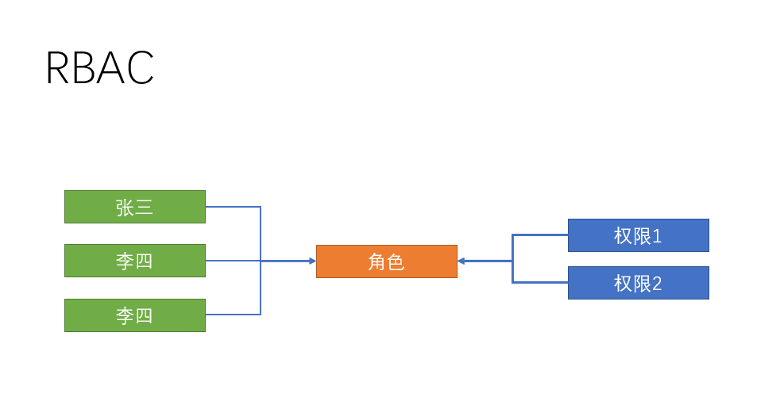
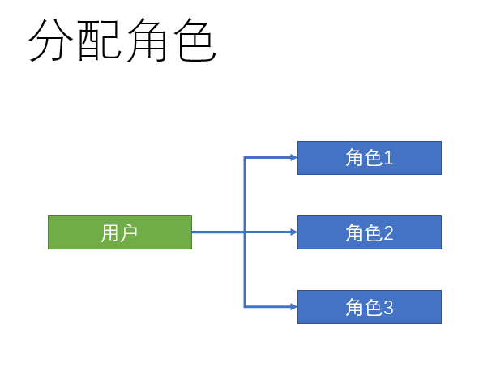
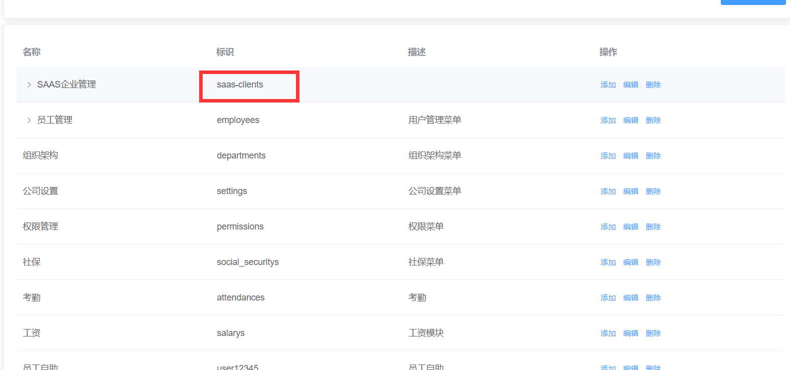
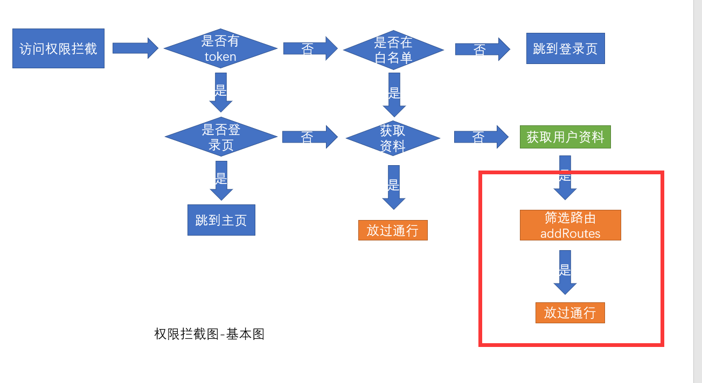
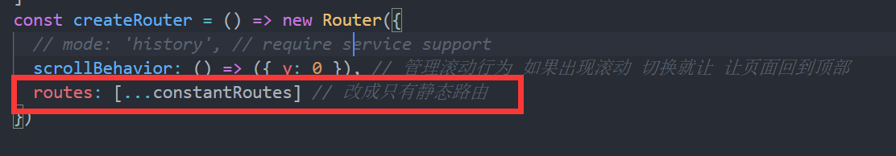
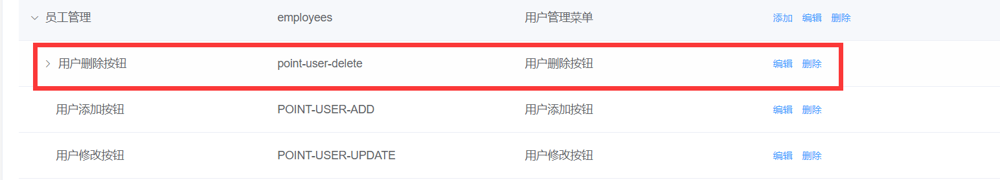

## 权限设计-RBAC的权限设计思想

> 首先，我们先了解下什么是传统的权限设计


从上面的图中，我们发现，传统的权限设计是对每个人进行单独的权限设置，但这种方式已经不适合目前企业的高效管控权限的发展需求，因为每个人都要单独去设置权限

>   基于此，RBAC的权限模型就应运而生了，RBAC(Role-Based Access control) ，也就是基于角色的权限分配解决方案，相对于传统方案，RBAC提供了中间层Role（角色），其权限模式如下



RBAC实现了用户和权限点的分离，想对某个用户设置权限，只需要对该用户设置相应的角色即可，而该角色就拥有了对应的权限，这样一来，权限的分配和设计就做到了极简，高效，当想对用户收回权限时，只需要收回角色即可，接下来，我们就在该项目中实施这一设想

## 给分配员工角色

**`目标`**在员工管理页面，分配角色

### 新建分配角色窗体

> 在上一节章节中，员工管理的角色功能，我们并没有实现，此章节我们实现给员工分配角色



从上图中，可以看出，用户和角色是**`1对多`**的关系，即一个用户可以拥有多个角色，比如公司的董事长可以拥有总经理和系统管理员一样的角色

首先，新建分配角色窗体 **`assign-role.vue`** 	


```vue
<template>
  <el-dialog title="分配角色" :visible="showRoleDialog">
    <!-- el-checkbox-group选中的是 当前用户所拥有的角色  需要绑定 当前用户拥有的角色-->
    <el-checkbox-group>
      <!-- 选项 -->
    </el-checkbox-group>
    <el-row slot="footer" type="flex" justify="center">
      <el-col :span="6">
        <el-button type="primary" size="small">确定</el-button>
        <el-button size="small">取消</el-button>
      </el-col>
    </el-row>
  </el-dialog>
</template>

<script>
export default {
  props: {
    showRoleDialog: {
      type: Boolean,
      default: false
    },
    // 用户的id 用来查询当前用户的角色信息
    userId: {
      type: String,
      default: null
    }
  }
}
</script>


```

### 获取角色列表和当前用户角色

**获取所有角色列表**

```vue
  <!-- 分配角色 -->
    <el-checkbox-group v-model="roleIds">
      <el-checkbox v-for="item in list" :key="item.id" :label="item.id">
        {{
          item.name
        }}
      </el-checkbox>
    </el-checkbox-group>
  
```

**获取角色列表**

```js
import { getRoleList } from '@/api/setting'

export default {
  props: {
    showRoleDialog: {
      type: Boolean,
      default: false
    },
    userId: {
      type: String,
      default: null
    }
  },
  data() {
    return {
      list: [], // 角色列表
      roleIds: []
    }
  },
  created() {
    this.getRoleList()
  },
  methods: {
    //  获取所有角色
    async getRoleList() {
      const { rows } = await getRoleList()
      this.list = rows
    }
  }
}
```

**获取用户的当前角色**  

```js
import { getUserDetailById } from '@/api/user'

 async getUserDetailById(id) {
      const { roleIds } = await getUserDetailById(id)
      this.roleIds = roleIds // 赋值本用户的角色
  }
```

**点击角色弹出层**

```vue
// 编辑角色
 async  editRole(id) {
      this.userId = id // props传值 是异步的
      await this.$refs.assignRole.getUserDetailById(id) // 父组件调用子组件方法
      this.showRoleDialog = true
    },
  <!-- 放置角色分配组件 -->
 <assign-role ref="assignRole" :show-role-dialog.sync="showRoleDialog" :user-id="userId" />
```

### 给员工分配角色

**分配角色接口**  **`api/employees.js`**

```js
/** *
 * 给用户分配角色
 * ***/
export function assignRoles(data) {
  return request({
    url: '/sys/user/assignRoles',
    data,
    method: 'put'
  })
}
```

**确定保存**  **`assign-role`**

```js
async btnOK() {
      await assignRoles({ id: this.userId, roleIds: this.roleIds })
      //   关闭窗体
      this.$emit('update:showRoleDialog', false)
    },
```

**取消或者关闭 **  **`assign-role`** 

```js
btnCancel() {
      this.roleIds = [] // 清空原来的数组
      this.$emit('update:showRoleDialog', false)
    }
```

**提交代码**

**`本节任务`** 分配员工权限

## 权限点管理页面开发

**`目标`**： 完成权限点页面的开发和管理

### 新建权限点管理页面

> 人已经有了角色， 那么权限是什么

在企业服务中，权限一般分割为 **页面访问权限**，**按钮操作权限**，**API访问权限**

> API权限多见于在后端进行拦截，所以我们这一版本只做**`页面访问`**和**`按钮操作授权`/**

由此，我们可以根据业务需求设计权限管理页面


**完成权限页面结构** **`src/views/permission/index.vue`**

```vue
<template>
  <div class="dashboard-container">
    <div class="app-container">
      <!-- 靠右的按钮 -->
      <page-tools>
        <template v-slot:after>
          <el-button type="primary" size="small">添加权限</el-button>
        </template>
      </page-tools>
      <!-- 表格 -->
      <el-table border>
        <el-table-column align="center" label="名称" />
        <el-table-column align="center" label="标识" />
        <el-table-column align="center" label="描述" />
        <el-table-column align="center" label="操作">
          <template>
            <el-button type="text">添加</el-button>
            <el-button type="text">编辑</el-button>
            <el-button type="text">删除</el-button>
          </template>
        </el-table-column>

      </el-table>
    </div>
  </div>
</template>
```

**封装权限管理的增删改查请求**  **`src/api/permisson.js`**

```js
// 获取权限
export function getPermissionList(params) {
  return request({
    url: '/sys/permission',
    params
  })
}
// 新增权限
export function addPermission(data) {
  return request({
    url: '/sys/permission',
    method: 'post',
    data
  })
}

// 更新权限
export function updatePermission(data) {
  return request({
    url: `/sys/permission/${data.id}`,
    method: 'put',
    data
  })
}

// 删除权限
export function delPermission(id) {
  return request({
    url: `/sys/permission/${id}`,
    method: 'delete'
  })
}
// 获取权限详情
export function getPermissionDetail(id) {
  return request({
    url: `/sys/permission/${id}`
  })
}

```

### 获取权限数据并转化树形

这里，我们通过树形操作方法，将列表转化成层级数据

```vue
<script>
import { getPermissionList } from '@/api/permission'
import { transListToTreeData } from '@/utils'
export default {
data() {
    return {
      list: [],
      formData: {
        name: '', // 名称
        code: '', // 标识
        description: '', // 描述
        type: '', // 类型 该类型 不需要显示 因为点击添加的时候已经知道类型了
        pid: '', // 因为做的是树 需要知道添加到哪个节点下了
        enVisible: '0' // 开启
      },
      rules: {
        name: [{ required: true, message: '权限名称不能为空', trigger: 'blur' }],
        code: [{ required: true, message: '权限标识不能为空', trigger: 'blur' }]
      },
      showDialog: false
    }
  },
  created() {
    this.getPermissionList()
  },
  computed: {
    showText() {
      return this.formData.id ? '编辑' : '新增'
    }
  },
  methods: {
    async  getPermissionList() {
      this.list = transListToTreeData(await getPermissionList(), '0')
    }
  }

}
</script>
```

**绑定表格数据**

```vue
  <el-table :data="list" border="" row-key="id">
          <el-table-column label="名称" prop="name" />
          <el-table-column label="标识" prop="code" />
          <el-table-column label="描述" prop="description" />
          <el-table-column label="操作">
            <template slot-scope="{ row }">
              <el-button v-if="row.type === 1" type="text" @click="addPermission(row.id, 2)">添加</el-button>
              <el-button type="text" @click="editPermission(row.id)">编辑</el-button>
              <el-button type="text" @click="delPermission(row.id)"> 删除</el-button>
            </template>
          </el-table-column>
        </el-table>
```

需要注意的是， 如果需要树表， 需要给**el-table**配置**row-key**属性  id

> 当type为1时为访问权限，type为2时为功能权限

> 和前面内容一样，我们需要完成 新增权限 / 删除权限 / 编辑权限

### 新增编辑权限的弹层

**新增权限/编辑权限弹层**

```vue
  <!-- 放置一个弹层 用来编辑新增节点 -->
   <el-dialog :title="`${showText}权限点`" :visible="showDialog" @close="btnCancel">
      <!-- 表单 -->
      <el-form ref="perForm" :model="formData" :rules="rules" label-width="120px">
        <el-form-item label="权限名称" prop="name">
          <el-input v-model="formData.name" style="width:90%" />
        </el-form-item>
        <el-form-item label="权限标识" prop="code">
          <el-input v-model="formData.code" style="width:90%" />
        </el-form-item>
        <el-form-item label="权限描述">
          <el-input v-model="formData.description" style="width:90%" />
        </el-form-item>
        <el-form-item label="开启">
          <el-switch
            v-model="formData.enVisible"
            active-value="1"
            inactive-value="0"
          />
        </el-form-item>
      </el-form>
      <el-row slot="footer" type="flex" justify="center">
        <el-col :span="6">
          <el-button size="small" type="primary" @click="btnOK">确定</el-button>
          <el-button size="small" @click="btnCancel">取消</el-button>
        </el-col>
      </el-row>
    </el-dialog>
```

### 新增，编辑，删除权限点

**新增/删除/编辑逻辑**

```js
import { updatePermission, addPermission, getPermissionDetail, delPermission, getPermissionList } from '@/api/permission'
  methods: {
     // 删除操作
    async delPermission(id) {
      try {
        await this.$confirm('确定要删除该数据吗')
        await delPermission(id)
        this.getPermissionList()
        this.$message.success('删除成功')
      } catch (error) {
        console.log(error)
      }
    },
    btnOK() {
      this.$refs.perForm.validate().then(() => {
        if (this.formData.id) {
          return updatePermission(this.formData)
        }
        return addPermission(this.formData)
      }).then(() => {
        //  提示消息
        this.$message.success('新增成功')
        this.getPermissionList()
        this.showDialog = false
      })
    },
    btnCancel() {
      this.formData = {
        name: '', // 名称
        code: '', // 标识
        description: '', // 描述
        type: '', // 类型 该类型 不需要显示 因为点击添加的时候已经知道类型了
        pid: '', // 因为做的是树 需要知道添加到哪个节点下了
        enVisible: '0' // 开启
      }
      this.$refs.perForm.resetFields()
      this.showDialog = false
    },
    addPermission(pid, type) {
      this.formData.pid = pid
      this.formData.type = type
      this.showDialog = true
    },
    async editPermission(id) {
      // 根据获取id获取详情
      this.formData = await getPermissionDetail(id)
      this.showDialog = true
    }
  }
 
```

**提交代码**

**`本节任务`**: 权限点管理页面开发

## 给角色分配权限

**`目标`**： 完成给角色分配权限的业务

### 新建分配权限弹出层

> 在公司设置的章节中，我们没有实现分配权限的功能，在这里我们来实现一下

**封装分配权限的api**  **`src/api/setting.js`**

```js
// 给角色分配权限
export function assignPerm(data) {
  return request({
    url: '/sys/role/assignPrem',
    method: 'put',
    data
  })
}

```
**给角色分配权限弹出层**

```vue
<el-dialog title="分配权限" :visible="showPermDialog" @close="btnPermCancel">
      <!-- 权限是一颗树 -->
      <!-- 将数据绑定到组件上 -->
      <!-- check-strictly 如果为true 那表示父子勾选时  不互相关联 如果为false就互相关联 -->
      <!-- id作为唯一标识 -->
      <el-tree
        ref="permTree"
        :data="permData"
        :props="defaultProps"
        :show-checkbox="true"
        :check-strictly="true"
        :default-expand-all="true"
        :default-checked-keys="selectCheck"
        node-key="id"
      />
      <!-- 确定 取消 -->
      <el-row slot="footer" type="flex" justify="center">
        <el-col :span="6">
          <el-button type="primary" size="small" @click="btnPermOK">确定</el-button>
          <el-button size="small" @click="btnPermCancel">取消</el-button>
        </el-col>
      </el-row>
    </el-dialog>
```

**定义数据**

```js
      showPermDialog: false, // 控制分配权限弹层的显示后者隐藏
      defaultProps: {
        label: 'name'
      },
       permData: [], // 专门用来接收权限数据 树形数据
      selectCheck: [], // 定义一个数组来接收 已经选中的节点
      roleId: null // 用来记录分配角色的id
```

**点击分配权限**

```vue
<el-button size="small" type="success" @click="assignPerm(row.id)">分配权限</el-button>
```

### 给角色分配权限

**分配权限**/**树形数据**

```js
 import { transListToTreeData } from '@/utils'
import { getPermissionList } from '@/api/permission'
methods: {
    // 点击分配权限
  // 获取权限点数据 在点击的时候调用 获取权限点数据
    async assignPerm(id) {
      this.permData = tranListToTreeData(await getPermissionList(), '0') // 转化list到树形数据
      this.roleId = id
      // 应该去获取 这个id的 权限点
      // 有id 就可以 id应该先记录下来
      const { permIds } = await getRoleDetail(id) // permIds是当前角色所拥有的权限点数据
      this.selectCheck = permIds // 将当前角色所拥有的权限id赋值
      this.showPermDialog = true
    },
    async  btnPermOK() {
      // 调用el-tree的方法
      // console.log(this.$refs.permTree.getCheckedKeys())
      await assignPerm({ permIds: this.$refs.permTree.getCheckedKeys(), id: this.roleId })
      this.$message.success('分配权限成功')
      this.showPermDialog = false
    },
    btnPermCancel() {
      this.selectCheck = [] // 重置数据
      this.showPermDialog = false
    }
}

```

**提交代码**

**`本节任务`** 给角色分配权限

## 前端权限应用-页面访问和菜单

**`目标`**： 在当前项目应用用户的页面访问权限

### 权限受控的主体思路

> 到了最关键的环节，我们设置的权限如何应用？

在上面的几个小节中，我们已经把给用户分配了角色， 给角色分配了权限，那么在用户登录获取资料的时候，会自动查出该用户拥有哪些权限，这个权限需要和我们的菜单还有路由有效结合起来

> 我们在路由和页面章节中，已经介绍过，动态权限其实就是根据用户的实际权限来访问的，接下来我们操作一下



在权限管理页面中，我们设置了一个**标识**， 这个标识可以和我们的路由模块进行关联，也就是说，如果用户拥有这个标识，那么用户就可以**拥有这个路由模块**，如果没有这个标识，就不能**访问路由模块**

> 用什么来实现？

vue-router提供了一个叫做[addRoutes](https://router.vuejs.org/zh/api/#router-addroutes)的API方法，这个方法的含义是**动态添加路由规则**

思路如下


### 新建Vuex中管理权限的模块

>  在**主页模块**章节中，我们将用户的资料设置到vuex中，其中便有权限数据，我们可以就此进行操作

我们可以在vuex中新增一个permission模块

**`src/store/modules/permission.js`**

```js
// vuex的权限模块
import { constantRoutes } from '@/router'
// vuex中的permission模块用来存放当前的 静态路由 + 当前用户的 权限路由
const state = {
  routes: constantRoutes // 所有人默认拥有静态路由
}
const mutations = {
  // newRoutes可以认为是 用户登录 通过权限所得到的动态路由的部分
  setRoutes(state, newRoutes) {
    // 下面这么写不对 不是语法不对 是业务不对
    // state.routes = [...state.routes, ...newRoutes]
    // 有一种情况  张三 登录 获取了动态路由 追加到路由上  李四登录 4个动态路由
    // 应该是每次更新 都应该在静态路由的基础上进行追加
    state.routes = [...constantRoutes, ...newRoutes]
  }
}
const actions = {}
export default {
  namespaced: true,
  state,
  mutations,
  actions
}

```

在Vuex管理模块中引入permisson模块

```js
import permission from './modules/permission'
	
const store = new Vuex.Store({
  modules: {
    // 子模块   $store.state.app.
    // mapGetters([])
    app,
    settings,
    user,
    permission
  },
  getters
})
```

### Vuex筛选权限路由

>  OK， 那么我们在哪将用户的标识和权限进行关联呢 ？


我们可以在这张图中，进一步的进行操作




访问权限的数据在用户属性**`menus`**中，**`menus`**中的标识该怎么和路由对应呢？


>   可以将路由模块的根节点**`name`**属性命名和权限标识一致，这样只要标识能对上，就说明用户拥有了该权限

这一步，在我们命名路由的时候已经操作过了


接下来， vuex的permission中提供一个action，进行关联

```js
import { asyncRoutes, constantRoutes } from '@/router'

const actions = {
  // 筛选权限路由
  // 第二个参数为当前用户的所拥有的菜单权限
  // menus: ["settings","permissions"]
  // asyncRoutes是所有的动态路由
  // asyncRoutes  [{path: 'setting',name: 'setting'},{}]
  filterRoutes(context, menus) {
    const routes = []
    //   筛选出 动态路由中和menus中能够对上的路由
    menus.forEach(key => {
      // key就是标识
      // asyncRoutes 找 有没有对象中的name属性等于 key的 如果找不到就没权限 如果找到了 要筛选出来
      routes.push(...asyncRoutes.filter(item => item.name === key)) // 得到一个数组 有可能 有元素 也有可能是空数组
    })
    // 得到的routes是所有模块中满足权限要求的路由数组
    // routes就是当前用户所拥有的 动态路由的权限
    context.commit('setRoutes', routes) // 将动态路由提交给mutations
    return routes // 这里为什么还要return  state数据 是用来 显示左侧菜单用的  return  是给路由addRoutes用的
  }
```

### 权限拦截出调用筛选权限Action

在拦截的位置，调用关联action， 获取新增routes，并且**addRoutes**

```js
// 权限拦截在路由跳转  导航守卫

import router from '@/router'
import store from '@/store' // 引入store实例 和组件中的this.$store是一回事
import nprogress from 'nprogress' // 引入进度条
import 'nprogress/nprogress.css' // 引入进度条样式
// 不需要导出  因为只需要让代码执行即可
// 前置守卫
// next是前置守卫必须必须必须执行的钩子  next必须执行 如果不执行 页面就死了
// next()  放过
// next(false) 跳转终止
// next(地址) 跳转到某个地址
const whiteList = ['/login', '/404'] // 定义白名单
router.beforeEach(async(to, from, next) => {
  nprogress.start() // 开启进度条的意思
  if (store.getters.token) {
    // 只有有token的情况下 才能获取资料
    //   如果有token
    if (to.path === '/login') {
      // 如果要访问的是 登录页
      next('/') // 跳到主页  // 有token 用处理吗？不用
    } else {
      // 只有放过的时候才去获取用户资料
      // 是每次都获取吗
      // 如果当前vuex中有用户的资料的id 表示 已经有资料了 不需要获取了 如果没有id才需要获取
      if (!store.getters.userId) {
        // 如果没有id才表示当前用户资料没有获取过
        // async 函数所return的内容 用 await就可以接收到
        const { roles } = await store.dispatch('user/getUserInfo')
        // 如果说后续 需要根据用户资料获取数据的话 这里必须改成 同步
        // 筛选用户的可用路由
        // actions中函数 默认是Promise对象 调用这个对象 想要获取返回的值话 必须 加 await或者是then
        // actions是做异步操作的
        const routes = await store.dispatch('permission/filterRoutes', roles.menus)
        // routes就是筛选得到的动态路由
        // 动态路由 添加到 路由表中 默认的路由表 只有静态路由 没有动态路由
        // addRoutes  必须 用 next(地址) 不能用next()
        router.addRoutes(routes) // 添加动态路由到路由表  铺路
        // 添加完动态路由之后
        next(to.path) // 相当于跳到对应的地址  相当于多做一次跳转 为什么要多做一次跳转
        // 进门了，但是进门之后我要去的地方的路还没有铺好，直接走，掉坑里，多做一次跳转，再从门外往里进一次，跳转之前 把路铺好，再次进来的时候，路就铺好了
      } else {
        next()
      }
    }
  } else {
    //   没有token的情况下
    if (whiteList.indexOf(to.path) > -1) {
      //  表示要去的地址在白名单
      next()
    } else {
      next('/login')
    }
  }
  nprogress.done() // 解决手动切换地址时 进度条不关闭的问题
})
// 后置守卫
router.afterEach(() => {
  nprogress.done() // 关闭进度条
})

```

### 静态路由动态路由解除合并

**注意**： 这里有个非常容易出问题的位置，当我们判断用户是否已经添加路由的前后，不能都是用**next()**，

在添加路由之后应该使用 **next(to.path)**， 否则会使刷新页面之后 权限消失，这属于一个vue-router的**已知缺陷**

同时，不要忘记，我们将原来的静态路由 + 动态路由合体的模式 改成 只有静态路由  **`src/router/index.js`**




>   此时，我们已经完成了权限设置的一半， 此时我们发现左侧菜单失去了内容，这是因为左侧菜单读取的是固定的路由，我们要把它换成实时的最新路由

在**`src/store/getters.js`**配置导出routes

```js
const getters = {
  sidebar: state => state.app.sidebar,
  device: state => state.app.device,
  token: state => state.user.token,
  name: state => state.user.userInfo.username, // 建立用户名称的映射
  userId: state => state.user.userInfo.userId, // 建立用户id的映射
  companyId: state => state.user.userInfo.companyId, // 建立用户的公司Id映射
  routes: state => state.permission.routes // 导出当前的路由
}
export default getters

```

在左侧菜单组件中， 引入routes

```js
  computed: {
    ...mapGetters([
      'sidebar', 'routes'
    ]),
```

>  OK，到现在为止，我们已经可以实现不同用户登录的时候，菜单是动态的了

**提交代码**

**`本节任务`** 前端权限应用-页面访问和菜单


## 登出时，重置路由权限和 404问题

**目标**： 处理当登出页面时，路由不正确的问题

>  上一小节，我们看似完成了访问权限的功能，实则不然，因为当我们登出操作之后，虽然看不到菜单，但是用户实际上可以访问页面，直接在地址栏输入地址就能访问

这是怎么回事？

>  这是因为我们前面在**addRoutes**的时候，一直都是在**加**，登出的时候，我们并没有删，也没有重置，也就是说，我们之前加的路由在登出之后一直在，这怎么处理？

大家留意我们的**router/index.js**文件，发现一个重置路由方法

```js
// 重置路由
export function resetRouter() {
  const newRouter = createRouter()
  router.matcher = newRouter.matcher // 重新设置路由的可匹配路径
}
```

没错，这个方法就是将路由重新实例化，相当于换了一个新的路由，之前**`加的路由`**自然不存在了，只需要在登出的时候， 处理一下即可

```js
  // 登出的action
  lgout(context) {
    // 删除token
    context.commit('removeToken') // 不仅仅删除了vuex中的 还删除了缓存中的
    // 删除用户资料
    context.commit('removeUserInfo') // 删除用户信息
    // 重置路由
    resetRouter()
    // 还有一步  vuex中的数据是不是还在
    // 要清空permission模块下的state数据
    // vuex中 user子模块  permission子模块
    // 子模块调用子模块的action  默认情况下 子模块的context是子模块的
    // 父模块 调用 子模块的action
    context.commit('permission/setRoutes', [], { root: true })
    // 子模块调用子模块的action 可以 将 commit的第三个参数 设置成  { root: true } 就表示当前的context不是子模块了 而是父模块
  }
```

除此之外，我们发现在页面刷新的时候，本来应该拥有权限的页面出现了404，这是因为404的匹配权限放在了静态路由，而动态路由在没有addRoutes之前，找不到对应的地址，就会显示404，所以我们需要将404放置到动态路由的最后

**`src/permission.js`**

```js
router.addRoutes([...routes, { path: '*', redirect: '/404', hidden: true }]) // 添加到路由表
```

**提交代码**

## 功能权限应用

**目标**： 实现功能权限的应用

### 功能权限的受控思路

>  上小节中，当我们拥有了一个模块，一个页面的访问权限之后，页面中的某些功能，用户可能有，也可能没有，这就是功能权限

这就是上小节，查询出来的数据中的**`points`**

>  比如，我们想对员工管理的删除功能做个权限怎么做？

首先需要在员工管理的权限点下， 新增一个删除权限点，启用



>   我们要做的就是看看用户，是否拥有**point-user-delete**这个point，有就可以让删除能用，没有就隐藏或者禁用

### 使用Mixin技术将检查方法注入

所以，我们可以采用一个新的技术 [mixin(混入)](https://cn.vuejs.org/v2/guide/mixins.html)来让所有的组件可以拥有一个公共的方法

**`src/mixin/checkPermission.js`**

```js
import store from '@/store'
export default {
  methods: {
    checkPermission(key) {
      const { userInfo } = store.state.user
      if (userInfo.roles.points && userInfo.roles.points.length) {
        return userInfo.roles.points.some(item => item === key)
      }
      return false
    }
  }
}

```


**在员工组件中检查权限点**

```vue
 <el-button :disabled="!checkPermission('POINT-USER-UPDATE')" type="text" size="small" @click="$router.push(`/employees/detail/${obj.row.id}`)">查看</el-button>

```

此时，可以通过配置权限的方式，检查权限的可用性了

**提交代码**

